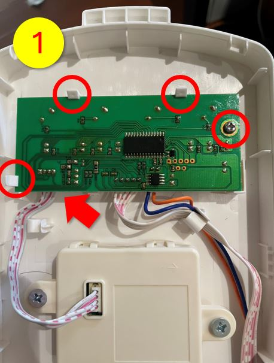
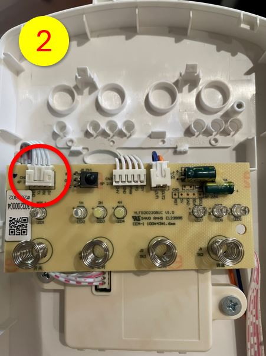
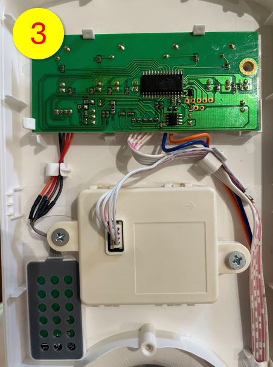

<!-- AirFan README — Argon-style (Automate brand navy + orange, clean white hero) -->
<!-- 2026-05-15:hero 改白底 + AUTOMATE logo SVG;砍 4-col stat strip;影片改縮圖點擊。 -->

<!-- AUTOMATE Logo (inline SVG,height 64px) -->
<svg width="320" height="55" viewBox="0 0 1412.26 241.88" xmlns="http://www.w3.org/2000/svg" aria-label="AUTOMATE">
  <g fill="none" stroke-miterlimit="10">
    <g stroke="#ff6f48" stroke-width="8">
      <circle cx="21.02" cy="86.69" r="17.02"/>
      <polyline points="77.94 240.38 77.94 155.97 31.96 100.72"/>
      <circle cx="72.84" cy="21.02" r="17.02"/>
      <polyline points="101.21 240.38 101.21 145.93 72.92 117.64 72.92 38.03"/>
      <circle cx="124.98" cy="73.74" r="17.02"/>
      <line x1="124.98" y1="240.38" x2="124.98" y2="90.75"/>
      <circle cx="178.3" cy="94.21" r="17.02"/>
      <polyline points="147.26 240.38 147.26 191.36 178.56 160.07 178.56 111.23"/>
    </g>
    <g><line stroke="#33506d" stroke-width="3" x1="207.25" y1="240.38" x2="1411.2" y2="240.38"/></g>
  </g>
  <g fill="#33506d" stroke-width="0">
    <path d="M426.04,209.58c-20.58,0-36.67-6.59-48.27-19.77-11.6-13.18-17.4-32.08-17.4-56.69V39.98h33.77v92.18c0,15.72,2.83,27.12,8.49,34.18,5.66,7.07,13.53,10.6,23.62,10.6s18.16-3.53,23.83-10.6c5.66-7.06,8.49-18.46,8.49-34.18V39.98h32.94v93.14c0,24.62-5.8,43.51-17.4,56.69-11.6,13.18-27.62,19.77-48.06,19.77Z"/>
    <path d="M552.37,206.72V71.42h-41.04v-31.44h111.76v31.44h-41.04v135.3h-29.68Z"/>
    <path d="M718.05,209.58c-11.9,0-22.87-2.14-32.9-6.43-10.04-4.29-18.78-10.32-26.23-18.1-7.45-7.78-13.22-16.91-17.31-27.39-4.09-10.48-6.13-21.91-6.13-34.3s2.04-24.02,6.13-34.42c4.08-10.4,9.85-19.49,17.31-27.27,7.45-7.78,16.16-13.82,26.13-18.1,9.96-4.29,20.89-6.43,32.79-6.43s22.82,2.11,32.79,6.31c9.96,4.21,18.67,10.21,26.12,17.98,7.45,7.78,13.22,16.91,17.31,27.39,4.08,10.48,6.13,22,6.13,34.54s-2.04,23.86-6.13,34.42c-4.09,10.56-9.86,19.73-17.31,27.51-7.45,7.78-16.16,13.78-26.12,17.98-9.97,4.21-20.82,6.31-32.58,6.31ZM717.83,176.95c6.74,0,12.93-1.31,18.6-3.93,5.66-2.62,10.64-6.35,14.94-11.2,4.3-4.84,7.63-10.48,10-16.91,2.36-6.43,3.55-13.61,3.55-21.56s-1.18-15.13-3.55-21.56c-2.37-6.43-5.7-12.07-10-16.91-4.3-4.84-9.28-8.57-14.94-11.19-5.66-2.62-11.86-3.93-18.6-3.93s-12.98,1.31-18.71,3.93c-5.73,2.62-10.72,6.35-14.94,11.19-4.23,4.85-7.53,10.48-9.89,16.91-2.37,6.43-3.55,13.62-3.55,21.56s1.18,15.12,3.55,21.56c2.36,6.43,5.66,12.07,9.89,16.91,4.23,4.84,9.21,8.57,14.94,11.2,5.73,2.62,11.97,3.93,18.71,3.93Z"/>
    <path d="M813,206.72l20.27-166.74h40.42l32.87,125.81h0l32.73-125.81h40.49l20.34,166.74h-31.96l-8.86-136.97h0l-37.53,138.33h-31.44l-35.59-138.33h0l-11.07,136.97h-30.67Z"/>
    <path d="M1215.57,206.72V71.42h-41.04v-31.44h111.76v31.44h-41.04v135.3h-29.68Z"/>
    <path d="M1312.96,206.72V39.98h96.92v30.97h-67.42v104.81h69.8v30.97h-99.3ZM1340.26,132.23v-30.25h61.74v30.25h-61.74Z"/>
    <path d="M1017.77,207.4l51.06-166.74h41.71l51.06,166.74h-31.15l-47.09-147.21h11.91l-47.09,147.21h-30.41ZM1046.54,171.67l7.51-29.3,64.54-10.65,7.63,27.36-79.68,12.59Z"/>
    <path d="M206.19,206.72l51.06-166.74h41.71l51.06,166.74h-31.15l-47.09-147.21h11.91l-47.09,147.21h-30.41ZM234.95,170.99l7.51-29.3,64.54-10.65,7.63,27.36-79.68,12.59Z"/>
  </g>
</svg>

<h1 style="font-size:42px;font-weight:800;margin:24px 0 6px 0;letter-spacing:-0.025em;color:#1c3d5a">AirFan</h1>

智能 DC 風扇模快 · Matter over Wi-Fi · 跨生態相容

<!-- Matter QR + 11 碼配對碼 並排 -->
<table align="center" style="margin:28px auto 0;border-collapse:collapse;border:none">
<tr>
<td align="center" style="border:none;padding:0 20px;vertical-align:middle">
  
  
Matter 配對 QR Code

</td>
<td align="left" style="border:none;padding:0 20px;vertical-align:middle">
  
11 碼配對碼

  
3642-630-6820

  
掃描左側 QR Code 即可自動配對 或在 App 中手動輸入 11 碼

</td>
</tr>
</table>

<!-- 影片區:YouTube thumbnail 點擊播放(GitHub 不允許 iframe,thumbnail 是極限) -->

  ⬆️ HA → Apple Home · Apple Home → 產品接入與使用說明 ⬆️

---

<b>📑 目錄</b>

1. [產品簡介](#1-產品簡介)
2. [硬體說明](#2-硬體說明)
3. [面板按鍵與遙控](#3-面板按鍵與遙控)
4. [接入智能生態(初次配對)](#4-接入智能生態初次配對)
5. [跨生態接入(Matter Multi-Admin)](#5-跨生態接入matter-multi-admin)
6. [Web UI:首頁(日常設定)](#6-web-ui首頁日常設定)
7. [風速映射對照](#7-風速映射對照)
8. [OTA 韌體更新](#8-ota-韌體更新)
9. [工廠重置](#9-工廠重置)
10. [故障排除](#10-故障排除)
11. [安全使用](#11-安全使用)
12. [規格表](#12-規格表)

---

<h2 style="color:#1c3d5a;border-bottom:3px solid #ff6f48;padding-bottom:8px;margin-top:48px;font-size:28px">1. 產品簡介</h2>

AirFan 是 AUTOMATE 推出的 Matter 智能 DC 風扇控制器,**直接接入 Apple Home / Google Home / Home Assistant / SmartThings / Alexa**,不需專屬 Hub。

風扇本體用原廠 OEM 控制板,我們替換掉原本的 Tuya 雲端 Wi-Fi 模組,改成 Matter 模組。這樣一來:

<table style="width:100%;border-collapse:separate;border-spacing:8px;margin:16px 0">
<tr><td width="50%" style="background:#fff;padding:18px;border-radius:14px;border:1px solid #e5e7eb;box-shadow:0 2px 8px rgba(0,0,0,0.04)">

☁️ 不需雲端帳號

完全100%本地控制

</td>
<td width="50%" style="background:#fff;padding:18px;border-radius:14px;border:1px solid #e5e7eb;box-shadow:0 2px 8px rgba(0,0,0,0.04)">

📡 保留原廠遙控

遙控器走原 RF/IR 通路,跟 Matter 並行

</td></tr>
<tr><td style="background:#fff;padding:18px;border-radius:14px;border:1px solid #e5e7eb;box-shadow:0 2px 8px rgba(0,0,0,0.04)">

🌪️ 原 7 段風速

全部可用,Matter 對映 1–100 % 滑桿

</td>
<td style="background:#fff;padding:18px;border-radius:14px;border:1px solid #e5e7eb;box-shadow:0 2px 8px rgba(0,0,0,0.04)">

↔️ 擺頭(yaw)

Matter <code>RockSetting</code> 

</td></tr>
<tr><td style="background:#fff;padding:18px;border-radius:14px;border:1px solid #e5e7eb;box-shadow:0 2px 8px rgba(0,0,0,0.04)">

🌙 面板指示燈開關

原廠操作面板上的狀態 LED 較亮,睡覺時可從生態 App 一鍵關閉;對映 

</td>
<td style="background:#fff;padding:18px;border-radius:14px;border:1px solid #e5e7eb;box-shadow:0 2px 8px rgba(0,0,0,0.04)">

🌐 內建 Web UI

區網直接連、免註冊,風扇 + 燈一頁掌控

</td></tr>
</table>

### 1.1 規格速覽

| 項目 | 內容 |
|---|---|
| 通訊協定 | Matter 1.x over Wi-Fi |
| Wi-Fi | 2.4 GHz 802.11 b/g/n(不支援 5 GHz)|
| BLE | 5.0(僅配對用)|
| 處理器 | ESP32-C3(RISC-V 32-bit, 160 MHz, 4 MB Flash)|
| 風速段數(物理)| 7 段 |
| 風速映射(Matter)| 0–100 %(滑桿)|
| 擺頭 | 左右 yaw(RockLeftRight)|
| 面板指示燈 | 原廠操作面板狀態 LED,獨立可關閉 |
| 工作環境 | -10–50 °C / 10–90% RH(無凝結)|

### 1.2 包裝內容

- AirFan Matter 控制器模組 × 1
- 快速入門卡(含 Matter QR Code 與 11 碼配對碼)× 1

---

<h2 style="color:#1c3d5a;border-bottom:3px solid #ff6f48;padding-bottom:8px;margin-top:48px;font-size:28px">2. 硬體說明</h2>

### 2.1 改裝方式

依下圖三步驟,打開機殼 → 替換原有(或插入)端子接口 → 鎖回即可。

<table style="width:100%;border-collapse:separate;border-spacing:0 14px;margin:16px 0">
<tr><td style="background:#fff;padding:18px;border-radius:14px;border:1px solid #e5e7eb;box-shadow:0 2px 8px rgba(0,0,0,0.04)" valign="top">
<table style="border:none"><tr>
<td valign="top" style="padding-right:18px;border:none">1</td>
<td style="border:none">

打開機殼

移除外殼螺絲,輕掀外蓋

</td></tr></table>
</td></tr>

<tr><td style="background:#fff;padding:18px;border-radius:14px;border:1px solid #e5e7eb;box-shadow:0 2px 8px rgba(0,0,0,0.04)" valign="top">
<table style="border:none"><tr>
<td valign="top" style="padding-right:18px;border:none">2</td>
<td style="border:none">

替換原有(或插入)端子接口

拔掉原 Tuya Wi-Fi 模組,把 AirFan 模組對準同樣的 socket 插入

</td></tr></table>
</td></tr>

<tr><td style="background:#fff;padding:18px;border-radius:14px;border:1px solid #e5e7eb;box-shadow:0 2px 8px rgba(0,0,0,0.04)" valign="top">
<table style="border:none"><tr>
<td valign="top" style="padding-right:18px;border:none">3</td>
<td style="border:none">

鎖回機殼,完成

把外蓋鎖回,通電後等 5 秒進入配對模式

</td></tr></table>
</td></tr>
</table>

<blockquote style="border-left:4px solid #ff6f48;background:#fff7f4;padding:14px 18px;margin:16px 0;border-radius:0 12px 12px 0;color:#5a3520">
⚠️ <b>改裝前務必斷電</b>。模組本體為低壓 5V 工作。
</blockquote>

### 2.2 面板與接口

風扇本體一般接 AC 110V,**無需額外接線**。模組透過Wi-Fi通訊。

- **內建 Wi-Fi 天線**:無需外接
- **遙控接收器**:原有,獨立於 Matter 模組
- **面板配對鍵**:長按面板開關鍵5秒，全部LED閃一下就進入重置(章節 3.2)

### 2.3 配對碼資訊

| 項目 | 數值 |
|---|---|
| Matter QR Code | 快速入門卡 / 機身底部 |
| 11 碼手動配對碼 | `3642-630-6820` |
| Vendor ID | `0xFFF1` |
| Product ID | `0x8010` |
| 預設裝置名稱 | `AirFan-XXXXXX`(後 6 碼為 Wi-Fi MAC)|
| 預設 hostname | `automate-airfan-XXXXXX.local` |

<blockquote style="border-left:4px solid #007AFF;background:#eff7ff;padding:14px 18px;margin:16px 0;border-radius:0 12px 12px 0;color:#1c3d5a">
💡 配對碼遺失時,可在 Web UI(章節 6)裝置資訊區查看 hostname 反查機身。
</blockquote>

---

<h2 style="color:#1c3d5a;border-bottom:3px solid #ff6f48;padding-bottom:8px;margin-top:48px;font-size:28px">3. 面板按鍵與遙控</h2>

### 3.1 日常操作

| 操作 | 結果 |
|---|---|
| 原廠遙控器 | 開關 / 升降速 / 擺頭 — 跟 Matter 同步,Apple Home/HA 也會看到狀態變化 |
| 面板開關(配對鍵)單擊(< 0.6 秒)| 切換**電源**(等同遙控的 ON/OFF)|

<blockquote style="border-left:4px solid #007AFF;background:#eff7ff;padding:14px 18px;margin:16px 0;border-radius:0 12px 12px 0;color:#1c3d5a">
用遙控器或物理鍵改變風扇狀態時,Web UI 跟智能生態 App 會在 1~2 秒內看到新狀態。
</blockquote>

### 3.2 工廠重置

**長按面板上的「開關 / 風量鍵」直到看到「全部燈號閃一下」即可**(觸發瞬間原機台所有指示燈會同步閃一次,作為視覺確認)。

| 動作 | 結果 |
|---|---|
| 長按面板「開關 / 風量鍵」直到燈號全閃一下 | **工廠重置觸發**,清除 Matter 配對與 Wi-Fi,自動重啟進入可重新配對狀態 |

詳見 [章節 9. 工廠重置](#9-工廠重置)

### 3.3 原廠遙控器

原廠遙控器走 RF / IR 通路,**獨立於 Matter**:
- 遙控不需配對、不受 Wi-Fi 斷線影響
- 遙控觸發的開 / 關 / 改速 / 擺頭,Matter 端 1 秒內同步看到
- 反之,Matter 端控制也會反映在風扇實體狀態

### 3.4 面板指示燈(睡眠模式)

原廠操作面板上有**狀態指示燈**。在臥室、深夜使用時,**亮度可能干擾睡眠**。本產品把這顆指示燈也獨立暴露成 entity,使用者可以隨時關閉:

| 操作位置 | 操作方式 |
|---|---|
| **Apple Home** | 「面板指示燈」icon(燈泡圖示)→ 點一下切換 ON / OFF |
| **Home Assistant** | `light.airfan_xxxxxx` → toggle |
| **Web UI** | 章節 6.3 → 「面板指示燈」toggle |
| **原廠遙控器**(若有指示燈按鈕)| 直接按 |

<blockquote style="border-left:4px solid #007AFF;background:#eff7ff;padding:14px 18px;margin:16px 0;border-radius:0 12px 12px 0;color:#1c3d5a">
💡 <b>睡眠建議</b>:睡前用 Apple Home / HA 場景同時把<b>風扇調到低速</b> +<b>關閉面板指示燈</b>,房間就完全暗了。早上自動化再把面板指示燈打回 ON 也行。
</blockquote>

<blockquote style="border-left:4px solid #ff6f48;background:#fff7f4;padding:14px 18px;margin:16px 0;border-radius:0 12px 12px 0;color:#5a3520">
⚠️ <b>注意</b>:這顆指示燈控制的是<b>面板狀態 LED</b>(風扇本體上的小燈),不是吊扇照明燈;本產品搭配的機型 <b>不含照明功能</b>。
</blockquote>

---

<h2 style="color:#1c3d5a;border-bottom:3px solid #ff6f48;padding-bottom:8px;margin-top:48px;font-size:28px">4. 接入智能生態(初次配對)</h2>

### 4.1 配對前確認

✅ 開始前請確認

<ul style="margin:10px 0 0;color:#1a2533">
<li>路由器 <b>Wi-Fi 2.4 GHz</b> 可用(AirFan 不支援 5 GHz)</li>
<li>手機 <b>藍牙開啟</b>,跟 AirFan 距離 &lt; 1 公尺</li>
<li>手機<b>已加入</b> Matter 平台(Apple Home / Google Home / HA / Alexa)</li>
<li>至少有一台 Matter Controller 在線:
  <ul>
  <li><b>Apple</b>:iPhone / iPad / HomePod / Apple TV(iOS 16.1+)</li>
  <li><b>Google</b>:Nest Hub / Android 14+ 手機</li>
  <li><b>Home Assistant</b>:主機 / iPhone / Android 14+ 手機</li>
  <li><b>Alexa</b>:Echo Hub / Echo (4th gen) / Echo Show</li>
  </ul>
</li>
</ul>

### 4.2 Apple Home

<table style="width:100%;border-collapse:separate;border-spacing:0 8px;margin:16px 0">
<tr><td style="background:#fff;padding:18px;border-radius:14px;border:1px solid #e5e7eb;box-shadow:0 2px 8px rgba(0,0,0,0.04)" valign="top">
<table><tr><td valign="top" style="padding-right:14px">1</td>
<td>通電風扇,等模組完成上電(約 5 秒)</td></tr></table>
</td></tr>
<tr><td style="background:#fff;padding:18px;border-radius:14px;border:1px solid #e5e7eb;box-shadow:0 2px 8px rgba(0,0,0,0.04)" valign="top">
<table><tr><td valign="top" style="padding-right:14px">2</td>
<td>iPhone 開「家庭」App → 右上角 <b>+</b> → <b>加入配件</b></td></tr></table>
</td></tr>
<tr><td style="background:#fff;padding:18px;border-radius:14px;border:1px solid #e5e7eb;box-shadow:0 2px 8px rgba(0,0,0,0.04)" valign="top">
<table><tr><td valign="top" style="padding-right:14px">3</td>
<td>對準 QR Code 掃描;或選「沒有代碼/無法掃描」→ 輸入 <code>3642-630-6820</code></td></tr></table>
</td></tr>
<tr><td style="background:#fff;padding:18px;border-radius:14px;border:1px solid #e5e7eb;box-shadow:0 2px 8px rgba(0,0,0,0.04)" valign="top">
<table><tr><td valign="top" style="padding-right:14px">4</td>
<td>iPhone 自動傳 Wi-Fi 憑證</td></tr></table>
</td></tr>
<tr><td style="background:#fff;padding:18px;border-radius:14px;border:1px solid #e5e7eb;box-shadow:0 2px 8px rgba(0,0,0,0.04)" valign="top">
<table><tr><td valign="top" style="padding-right:14px">✓</td>
<td>配對完成 → 出現「<b>AirFan-XXXXXX</b>」(可在 App 內改名),包含**風扇**與**面板指示燈**兩個 icon</td></tr></table>
</td></tr>
</table>

### 4.3 Home Assistant

1. 通電 AirFan,等模組進入配對模式
2. 開 Home Assistant App → 設定 → Matter → 新增裝置 → **全新的裝置**
3. 掃 QR 或輸入 `3642-630-6820`
4. App 自動完成,出現 `fan.airfan_xxxxxx` + `light.airfan_xxxxxx`(後者控制面板指示燈,可在前端改名)

### 4.4 Google Home

1. 通電
2. 開「Google Home」App → 右上 **+** → **設定裝置** → **新裝置** → 選擇家庭
3. App 自動偵測「Matter 裝置」→ 點擊 → 掃 QR 或輸入 `3642-630-6820`
4. 依 App 指示完成 Wi-Fi 設定
5. 配對完成,可在「風扇」分類找到

### 4.5 Amazon Alexa

1. 通電
2. 開 Alexa App → 裝置 → **+** → **新增裝置** → **其他** → **Matter**
3. 掃 QR 或輸入 `3642-630-6820`
4. 完成

---

<h2 style="color:#1c3d5a;border-bottom:3px solid #ff6f48;padding-bottom:8px;margin-top:48px;font-size:28px">5. 跨生態接入(Matter Multi-Admin)</h2>

### 5.1 機制說明

Matter 規範允許**同一台 AirFan 同時加入多個生態**,最多 **5 個 Fabric**。例如同時被 Apple Home 與 Home Assistant 控制,風扇狀態會同步出現在兩個 App。

<blockquote style="border-left:4px solid #ff6f48;background:#fff7f4;padding:14px 18px;margin:16px 0;border-radius:0 12px 12px 0;color:#5a3520">
⚠️ <b>關鍵原則</b>:第二個生態起,<b>不能用出廠那組</b> <code>3642-630-6820</code> — 必須由<b>第一個已配對的生態</b>產生一組「分享配對碼」(每次新的、有時效)。
</blockquote>

### 5.2 從 Apple Home 分享給其他生態

1. 家庭 App → 長按 AirFan → **設定**(齒輪圖示)
2. 滑到底,找 **「開啟配對模式」**
3. App 顯示一組 11 碼**拷貝代碼**(15 分鐘內有效)
4. 在第二個生態 App「加入配件」流程輸入這組新碼

### 5.3 從 Home Assistant 分享給其他生態

1. Home Assistant App → 設定 → Matter → 指定轉出裝置 → **複製代碼 / 分享裝置**
2. **複製代碼**
3. 在第二個生態 App「加入配件」流程輸入這組新碼

### 5.4 常見誤區

| 誤操作 | 後果 | 正確做法 |
|---|---|---|
| 第二個生態用出廠 `3642-630-6820` | 配對失敗 | 用第一個生態生出來的「分享碼」 |
| 用 Apple 重置裝置後再加入 Google | Apple 那邊也會掉 | 不要重置,用「Multi-Admin 分享」流程 |
| 已加入 5 個生態還想加 | 失敗 | 移除其中一個再加 |
| Wi-Fi 不通就嘗試多 admin | 失敗 | 先確認原配對生態正常,Wi-Fi 通才能分享 |

---

<h2 style="color:#1c3d5a;border-bottom:3px solid #ff6f48;padding-bottom:8px;margin-top:48px;font-size:28px">6. Web UI:首頁(日常設定)</h2>

### 6.1 連線方式

配對成功後,AirFan 在區網提供 Web UI。打開瀏覽器,網址兩種擇一:

- **直接 IP**:在生態 App 內查看裝置 IP(例 `http://192.168.1.123`)
- **主機名稱**:`http://automate-airfan-XXXXXX.local`(XXXXXX 為機身 Wi-Fi MAC 後 6 碼)

<blockquote style="border-left:4px solid #007AFF;background:#eff7ff;padding:14px 18px;margin:16px 0;border-radius:0 12px 12px 0;color:#1c3d5a">
💡 手機與 AirFan 必須在<b>同一個 Wi-Fi 網段</b>。
</blockquote>

### 6.2 裝置資訊

| 區塊 | 內容 |
|---|---|
| **韌體版本** | 例 `v0.1.0` |
| **可用記憶體** | 例 `96kB` |
| **運行時間** | 例 `9m 30s` |
| **通訊狀態** | `Matter 已配對 (192.168.1.x) / 正常 (wifi)` |
| **製造日期** | `YYYY-MM`,由出廠燒入 |
| **使用說明** | 點藍色連結即跳到本份 README |

### 6.3 風扇控制

| 元件 | 行為 |
|---|---|
| **大數字 % 顯示** | 即時風速百分比(滑桿 + 物理檔位映射)|
| **拖滑桿** | 即時送 `/api/fan {action:"speed"}`,風扇立刻變速 + 開啟 |
| **物理檔位 N / 7** | 顯示對映到物理檔位(1–7) |
| **電源 toggle** | 即時切換電源 ON / OFF |
| **擺頭 (搖擺) toggle** | 即時切換左右擺頭 |
| **面板指示燈 toggle** | 即時切換原廠操作面板的狀態 LED(DP15);睡眠時建議關閉,Apple Home / HA 同步狀態 |

<blockquote style="border-left:4px solid #ff6f48;background:#fff7f4;padding:14px 18px;margin:16px 0;border-radius:0 12px 12px 0;color:#5a3520">
💡 拖滑桿到任何 &gt; 0 的位置會自動開啟風扇(對齊 Matter Fan Control spec)。
</blockquote>

---

<h2 style="color:#1c3d5a;border-bottom:3px solid #ff6f48;padding-bottom:8px;margin-top:48px;font-size:28px">7. 風速映射對照</h2>

物理 7 段 vs Matter 0–100 % 對照:

| 物理 DP3 | 對映 Matter % | 用途 |
|---|---|---|
| 0 | 0 %(關)| 電源 OFF |
| 1 | 14 % | 最弱 |
| 2 | 29 % | 弱 |
| 3 | 43 % | 中弱 |
| 4 | 57 % | 中 |
| 5 | 71 % | 中強 |
| 6 | 86 % | 強 |
| 7 | 100 % | 最強 |

**滑桿任意中間值** → 我們會用「ceil」公式 `ceil(pct × 7 / 100)` 量化到最近的物理檔位。例如:
- 拖到 **15 %** → = 2(實際 29 %)
- 拖到 **50 %** → = 4(實際 57 %)
- 拖到 **88 %** → = 7(實際 100 %)

Web UI 跟 Apple Home 會顯示你拖的數字(15 / 50 / 88),物理風扇實際跑到對應的整數檔(2 / 4 / 7)。**Tap-on 還原**:風扇從關狀態被 Apple Home 「點開」(自動送 100 %),會自動還原成上次使用的速度,不會每次都吹到最強。

---

<h2 style="color:#1c3d5a;border-bottom:3px solid #ff6f48;padding-bottom:8px;margin-top:48px;font-size:28px">8. OTA 韌體更新</h2>

### 8.1 更新流程

1. 連線 Web UI → 底部 **版更** Tab
2. 系統自動向官方檢查最新版本
3. 若有新版,顯示「有新版本可更新」+ 「開始更新」按鈕
4. 點擊「開始更新」→ 確認對話框 → 自動下載
5. 下載完成自動重啟,Web UI 自動 reload 回首頁

整個過程約 1–2 分鐘,期間風扇會暫時離線(物理風扇本體不受影響,遙控器仍可用)。

### 8.2 更新會保留 / 清除什麼

<table style="width:100%;border-collapse:separate;border-spacing:0;border:1px solid #dde3ec;border-radius:14px;overflow:hidden">
<tr style="background:#f7f9fc"><th align="left" style="padding:12px 16px;color:#1c3d5a;border-bottom:2px solid #ff6f48">項目</th><th style="padding:12px 16px;color:#1c3d5a;border-bottom:2px solid #ff6f48">保留</th></tr>
<tr><td style="padding:10px 16px;border-top:1px solid #eef1f6">Matter 配對(所有生態)</td><td align="center" style="padding:10px 16px;border-top:1px solid #eef1f6;color:#27ae60">✅ 保留</td></tr>
<tr><td style="padding:10px 16px;border-top:1px solid #eef1f6">Wi-Fi 帳密</td><td align="center" style="padding:10px 16px;border-top:1px solid #eef1f6;color:#27ae60">✅ 保留</td></tr>
<tr><td style="padding:10px 16px;border-top:1px solid #eef1f6">出廠製造日期(mfg_date)</td><td align="center" style="padding:10px 16px;border-top:1px solid #eef1f6;color:#27ae60">✅ 保留</td></tr>
<tr><td style="padding:10px 16px;border-top:1px solid #eef1f6">韌體版本</td><td align="center" style="padding:10px 16px;border-top:1px solid #eef1f6;color:#e74c3c">❌ 換新版</td></tr>
</table>

---

<h2 style="color:#1c3d5a;border-bottom:3px solid #ff6f48;padding-bottom:8px;margin-top:48px;font-size:28px">9. 工廠重置</h2>

### 9.1 面板按鍵重置(推薦)

> 💡 最簡單的方法,**完全不用拆機殼**。

**長按面板上的「開關 / 風量鍵」直到所有指示燈同時閃一下** — 這個閃動是 OEM 機台回饋的視覺確認,代表重置信號已透過內部 UART 傳給 AirFan 模組。

成功觸發後,AirFan 自動清除所有 Matter 配對 → 3 秒重啟 → 進入可重新配對狀態(LED 從正常熄滅切換成**雙閃**)。

> 不同 OEM 機台的按鍵觸發時間略有差異(3 秒、5 秒、10 秒都可能),**以看到「全部燈號閃一下」為準**,看到就放開。

### 9.2 Web UI 重置

- 版更頁 → 「重新配對裝置」card → 「清除配對」紅色按鈕
- 確認對話框 → 自動重啟

<blockquote style="border-left:4px solid #007AFF;background:#eff7ff;padding:14px 18px;margin:16px 0;border-radius:0 12px 12px 0;color:#1c3d5a">
💡 此項是 <b>Matter-only reset</b> — 只清配對 + Wi-Fi,<b>OEM 設定 / 品牌 / Logo / 說明連結保留</b>。等同硬體長按 10 秒。
</blockquote>

### 9.3 重置會清除什麼

<table style="width:100%;border-collapse:separate;border-spacing:0;border:1px solid #dde3ec;border-radius:14px;overflow:hidden">
<tr style="background:#f7f9fc"><th align="left" style="padding:12px 16px;color:#1c3d5a;border-bottom:2px solid #ff6f48">項目</th><th style="padding:12px 16px;color:#1c3d5a;border-bottom:2px solid #ff6f48">清除</th></tr>
<tr><td style="padding:10px 16px;border-top:1px solid #eef1f6">Matter 配對(所有生態)</td><td align="center" style="padding:10px 16px;border-top:1px solid #eef1f6;color:#e74c3c">✅ 清除</td></tr>
<tr><td style="padding:10px 16px;border-top:1px solid #eef1f6">Wi-Fi 帳密</td><td align="center" style="padding:10px 16px;border-top:1px solid #eef1f6;color:#e74c3c">✅ 清除</td></tr>
<tr><td style="padding:10px 16px;border-top:1px solid #eef1f6">出廠製造日期(mfg_date)</td><td align="center" style="padding:10px 16px;border-top:1px solid #eef1f6;color:#27ae60">❌ 保留</td></tr>
<tr><td style="padding:10px 16px;border-top:1px solid #eef1f6">韌體版本</td><td align="center" style="padding:10px 16px;border-top:1px solid #eef1f6;color:#27ae60">❌ 不變</td></tr>
<tr><td style="padding:10px 16px;border-top:1px solid #eef1f6">裝置認證資料 / DAC</td><td align="center" style="padding:10px 16px;border-top:1px solid #eef1f6;color:#27ae60">❌ 不變(內建出廠憑證)</td></tr>
</table>

<blockquote style="border-left:4px solid #ff6f48;background:#fff7f4;padding:14px 18px;margin:16px 0;border-radius:0 12px 12px 0;color:#5a3520">
💡 重置後跟全新開封一樣,需重新配對。Apple Home 該配對視窗會出現在「附近」分區,免重新掃 QR。
</blockquote>

---

<h2 style="color:#1c3d5a;border-bottom:3px solid #ff6f48;padding-bottom:8px;margin-top:48px;font-size:28px">10. 故障排除</h2>

### 10.1 配對相關

| 現象 | 原因 | 處理 |
|---|---|---|
| App 找不到裝置 | 沒進入配對模式 / 手機藍牙關閉 / 距離太遠 | 確認手機藍牙開、距離 < 1 m、Wi-Fi 是 2.4 GHz |
| App 顯示「無法加入」| 配對碼錯誤 / Fabric 已滿 | 重新輸入碼;若已用 5 個生態,先移除其一 |
| 第二個生態加不進 | 用了出廠那組碼 | 改用第一個生態的「分享碼」(章節 5)|
| 配對成功但 App 顯示離線 | DNS / mDNS 問題 / Wi-Fi 沒共用網段 | 確認手機跟風扇同一個 2.4G SSID,路由器不要走 Guest 隔離 |
| **想換 Wi-Fi / 已從生態刪除想重來** | 需重置 Matter 配對 | **長按面板「開關 / 風量鍵」直到所有指示燈閃一下**(章節 9.1)|

### 10.2 運作相關

| 現象 | 原因 | 處理 |
|---|---|---|
| App 中風扇顯示離線 | Wi-Fi 斷線 / 路由器重啟 | 等 1–2 分鐘自動回連;不行就重新通電 |
| Apple Home 拉滑桿但風扇沒動 | Wi-Fi 不通 / Matter session 斷 | 確認 Wi-Fi 通;不行就重啟風扇本體 AC |
| 拖到 50 % 但風扇變很大聲 | 50 % → 物理 4 檔(已經中強)| 量化到最近的物理檔位是設計如此;若要小一點拖到 < 29 % |
| 遙控可動,Matter App 沒同步 | UART 通訊異常 | 重啟風扇 AC,模組會重新跟 MCU 握手 |
| 擺頭沒反應 | 模型可能不支援擺頭 / DP5 已關閉 | 確認原廠遙控按擺頭有反應(若無 = 機型不支援)|

### 10.3 OTA 相關

| 現象 | 原因 | 處理 |
|---|---|---|
| 版更頁顯示「無法取得版本」| 裝置連不到 GitHub | 檢查網路,可能是 DNS / 網路 / 防火牆問題 |
| 「開始更新」後一直 0% | 下載卡住 | 等 5 分鐘;不行就重啟裝置再試 |
| 更新失敗 | 韌體損毀 / 供電不足 | 重啟裝置(會走舊版),確認供電後重試 |
| 更新後 Apple Home 看到 PID 變化警告 | 重大 PID 改版才會 | 屬正常;按提示重新接受裝置即可,配對不會掉 |

---

<h2 style="color:#1c3d5a;border-bottom:3px solid #ff6f48;padding-bottom:8px;margin-top:48px;font-size:28px">11. 安全使用</h2>

- 🔌 接線 / 拆卸**先斷電**,確認符合機型

---

<h2 style="color:#1c3d5a;border-bottom:3px solid #ff6f48;padding-bottom:8px;margin-top:48px;font-size:28px">12. 規格表</h2>

| 項目 | 規格 |
|---|---|
| 產品名稱 | AirFan(吊扇控制器)|
| 品牌 | AUTOMATE |
| 通訊協定 | Matter 1.x over Wi-Fi |
| Wi-Fi | 2.4 GHz 802.11 b/g/n |
| 藍牙 | BLE 5.0(僅配對)|
| 處理器 | ESP32-C3(RISC-V 32-bit, 160 MHz)|
| Flash | 4 MB |
| Matter VID / PID | `0xFFF1` / `0x8010` |
| Matter Device Type | endpoint 1 = `0x002B` Fan(MultiSpeed + Rocking) endpoint 2 = `0x0100` On/Off Light |
| MCU 介面 | UART 9600 8N1(原 Tuya DP 協定:DP1/DP3/DP5/DP15)|
| 風速段數(物理)| 7 段 |
| 風速映射(Matter)| 0–100 %(自動量化)|
| 擺頭(yaw)| 支援(對映 Matter `RockSetting` bit0)|
| 面板指示燈開關 | 支援(獨立 OnOff endpoint,對映 DP15;睡眠模式可關閉)|
| 待機功耗(模組)| < 0.3 W |
| 工作溫度 | -10 °C – 50 °C |
| 工作濕度 | 10% – 90% RH(無凝結)|

---

<b style="color:#1c3d5a">AUTOMATE</b> · AirFan · 韌體 v0.1.5

2026-05 上市

