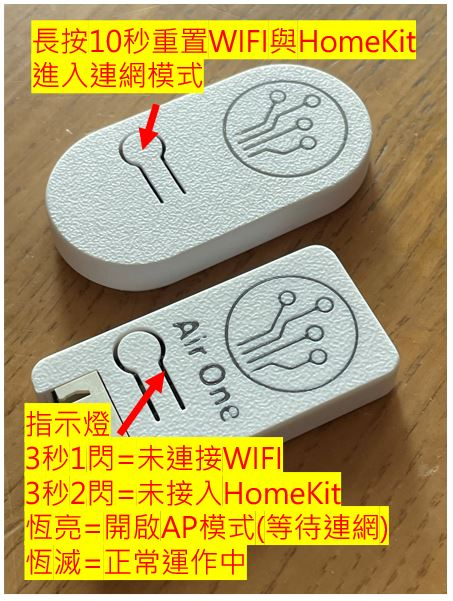
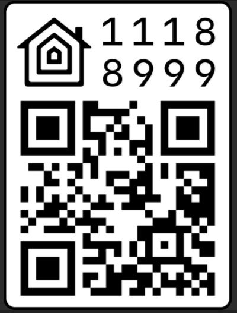

## 外觀功能介紹

## 連接WiFi
- 連接專屬的訊號線靜待設備開機
- 長按按鈕進入配網模式
- 手機搜尋設備發出的熱點AP接入後指定自家wifi與密碼完成連網。
## 接入 APPLE HomeKit
- apple 家庭 app 選加入配件掃描產品背後QR-Code 或輸入 11188999 加入配件。
- 不同的產品會自動辨識設備類別可直接接入
- 
## 關於空調提醒與注意事項
- 大金空調選擇自動模式會自動將溫度設定25度，這時調整溫度數據將無效。
- 日立、國際品牌的空調自動模式會依該公司所定的規則執行，同樣調整溫度數據無效。
- Homekit風速是以1-100方式呈現，依據各家風速段位有所差異，依序是自動、一級、二級、三級直到最高100%，請自行依據各家說明書對照0~100%與各段位的對應位置。
- Homekit風向擺動只有開關的選項，開啟視為左右擺動模式。
