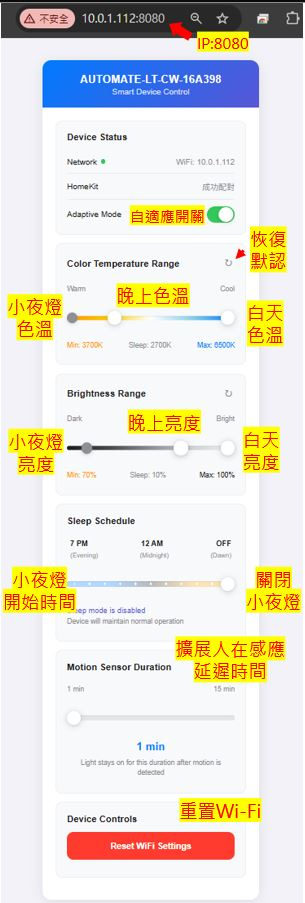

## 開始使用
### 打開連網功能
- 面板黑色按鍵長按超過10秒會重置會跳出連網熱點。 
- 手機搜尋wifi AUTOMATE-LT-CW-xxxxxx 進入連網頁面
- 等待自動掃描環境中的wifi訊號後指定自家wifi與輸入密碼後儲存
- 後續可以通過進入蘋果家庭app，選擇加入配件後掃描QRCodec或在更多選項頁面輸入11188999即可
### 自適應燈光調參
- 接入網路後手機掃描產品自適應調參QRCodec畫面如下，或在路由器中找到本產品被分配的IP 輸入 [IP]:8080
  

