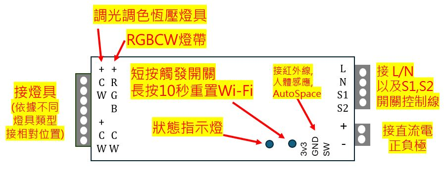
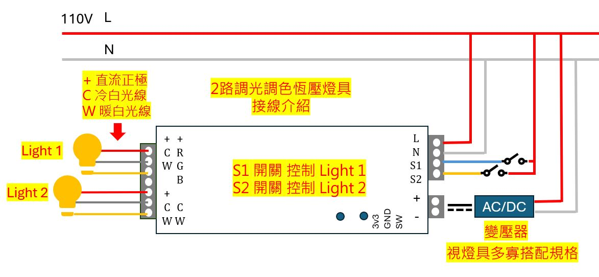
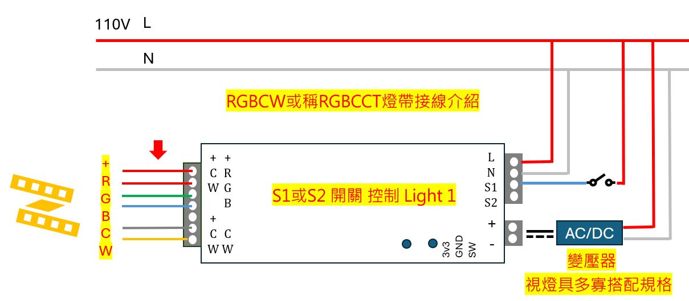
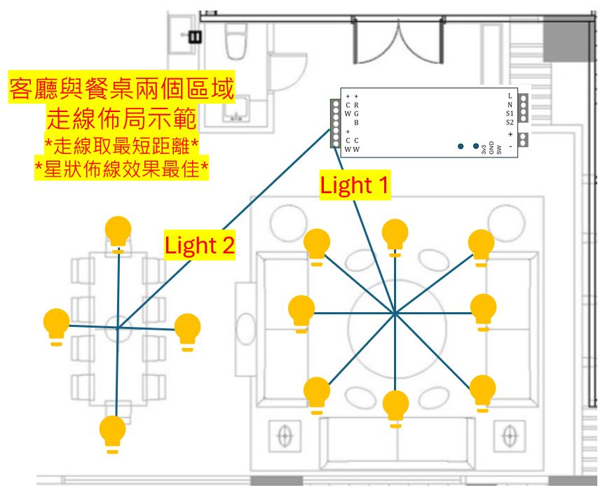
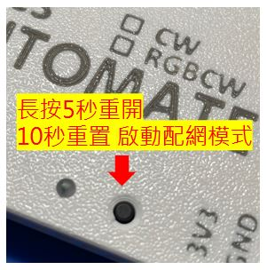

### 外觀介紹

### 如何接線與走線規劃建議

### 啟動連網模式

### 接入自家網路(WIFI)
 * 重置後手機靠近設備找wifi熱點 automate-lt-cw-xxxxxx，接入後等待數秒手機自動跳轉引導畫面選擇wifi名城與密碼存檔完成。(若沒自動切換可瀏覽器輸入192.168.4.1)。

### Homekit 自適應燈光設置
* 依據日出日落時間燈光會隨著太陽角度自動轉換色溫、亮度的自動化機制。
* 日出日落以台灣地區為主，若要在其他地區使用，請告知出廠時改變參數。
* 可設置最高(白天)與最低(夜晚)的亮度、色溫參數，並打開自適應開關即可，燈具會根據太陽角度自適應變化，另外有個睡眠模式，例如設置半夜2點開始亮度5%色溫調最黃，一旦過了這個時間打開燈具就變成了小夜燈直到日出，設置在廁所浴室非常好用不怕半夜尿尿燈光亮瞎睡意。
* 自適應一旦打開就會按照程序做變化，若手動進行調整亮度或色溫將暫停自適應直到燈光關閉後再打開前為止。

### Homekit版本自適應畫面說明
* 輸入 IP:8080 即可進入設置頁面

### HA 自適應燈光設置
* 請安裝HA的自適應燈光插件，並按說明設置即可。

