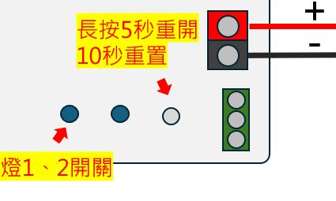
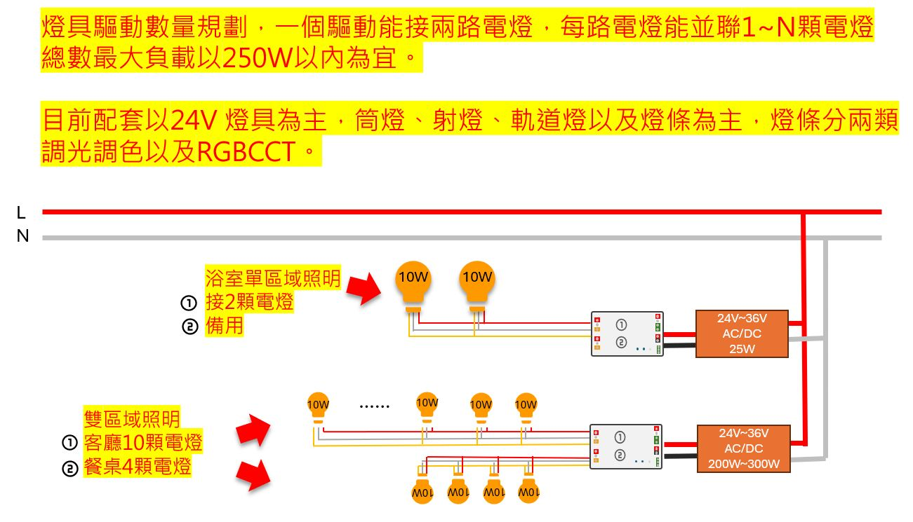
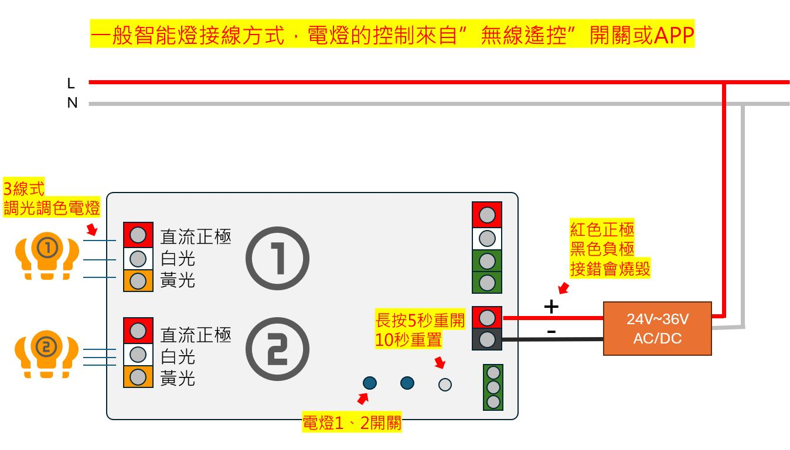
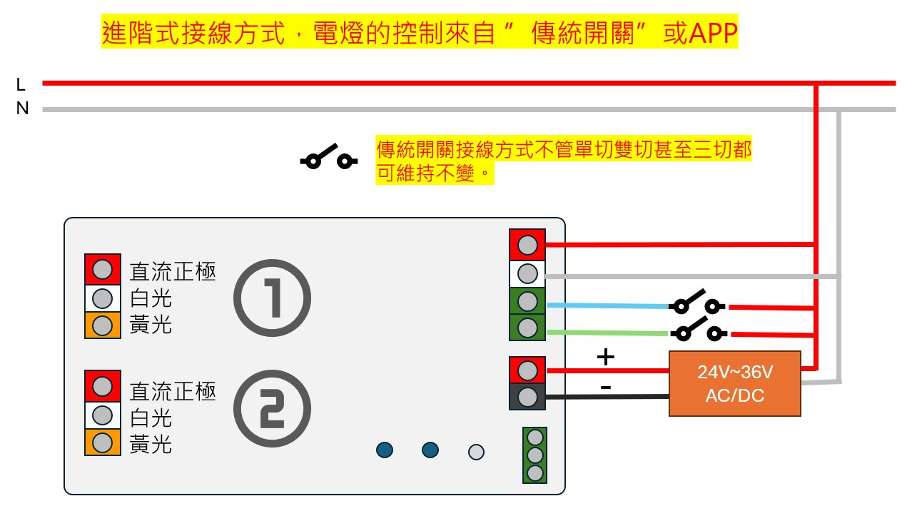
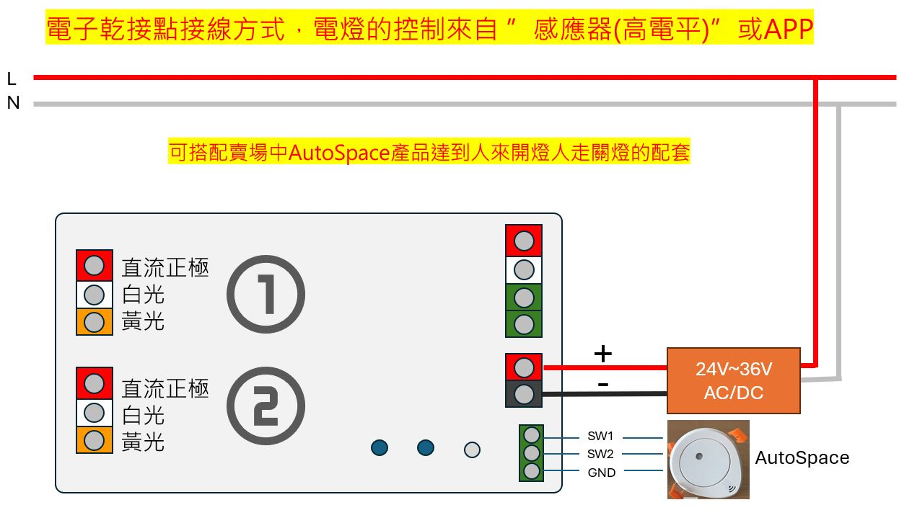
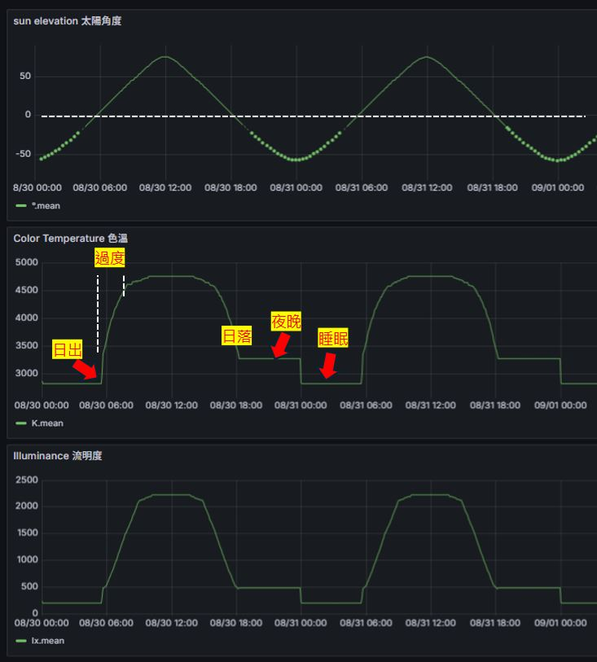
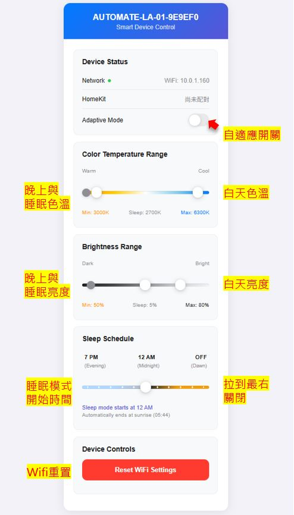

# Homekkit版本說明
## 重啟重置設備

## 接入自家網路(WIFI)
### HA版本
 * 上電稍待1~2分鐘手機靠近設備找wifi熱點 automate-lt-Pro-xxxxxx，接入後手機切換到瀏覽器輸入192.168.4.1即可指定自家wifi與密碼，HA會自動找到設備。
### HK版本* 
 * 上電稍待1~2分鐘手機靠近設備找wifi熱點 automate-lo-01-xxxxxx，會自動跳出指定自家wifi與密碼，再掃描QRcode接入Apple Home。
 * HK版本 要設置自適應燈光參數，請路由器找尋該設備被分配的IP位置，在瀏覽器輸入  "網址:8080" 例如 192.168.8.20:8080 即可。

### 燈具規劃

### 一般接法

### 進階接法.JPG

### autospace接法.JPG

### Homekit 自適應燈光設置
* 依據日出日落時間燈光會隨著太陽角度自動轉換色溫、亮度的自動化機制。
* 日出日落以台灣地區為主，若要在其他地區使用，請告知出廠時改變參數。
* 可設置最高(白天)與最低(夜晚)的亮度、色溫參數，並打開自適應開關即可，燈具會根據太陽角度自適應變化，另外有個睡眠模式，例如設置半夜2點開始亮度5%色溫調最黃，一旦過了這個時間打開燈具就變成了小夜燈直到日出，設置在廁所浴室非常好用不怕半夜尿尿燈光亮瞎睡意。
* 自適應一旦打開就會按照程序做變化，若手動進行調整亮度或色溫將暫停自適應直到燈光關閉後再打開前為止。

### Homekit版本自適應畫面說明
* 輸入 IP:8080 即可進入設置頁面

