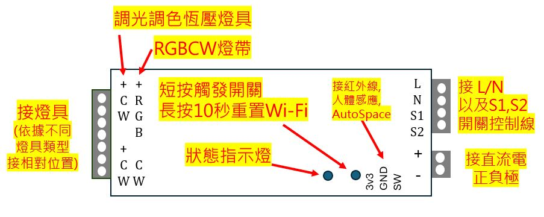
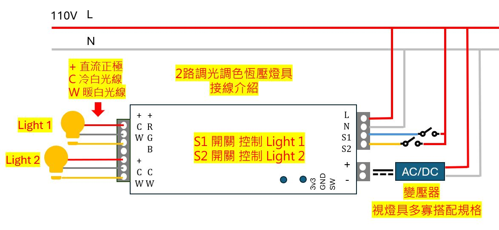
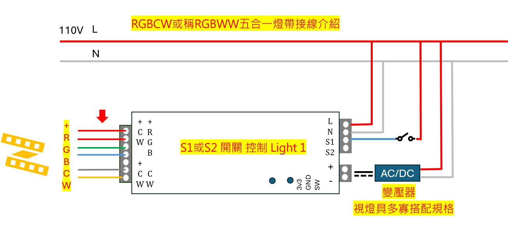
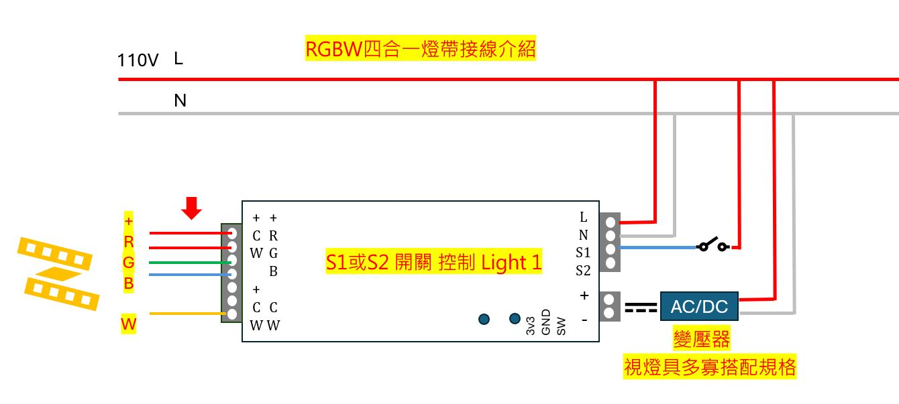
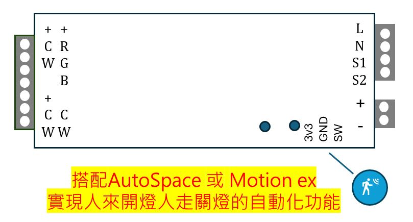
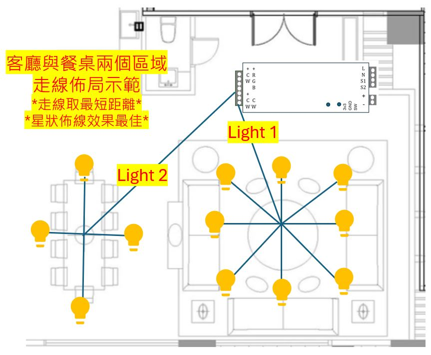
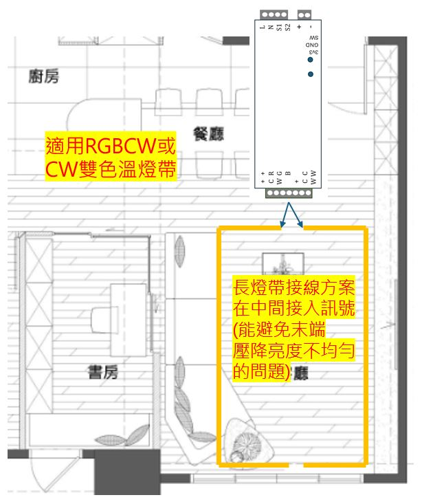
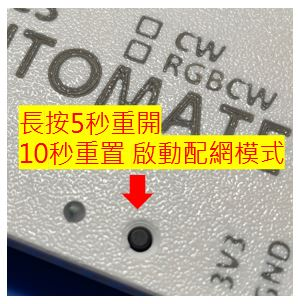
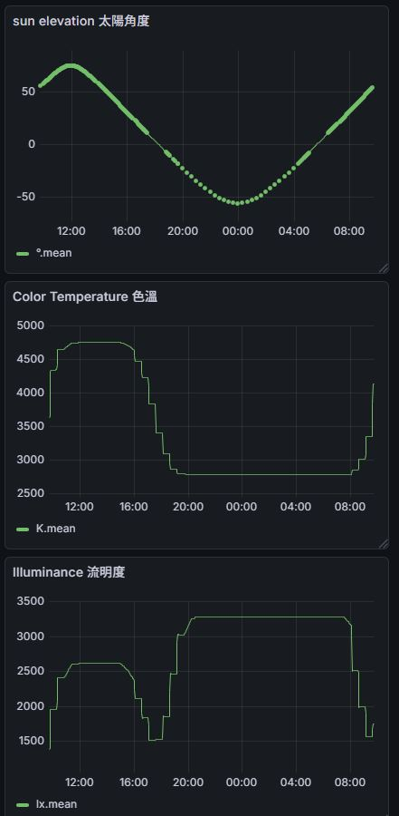
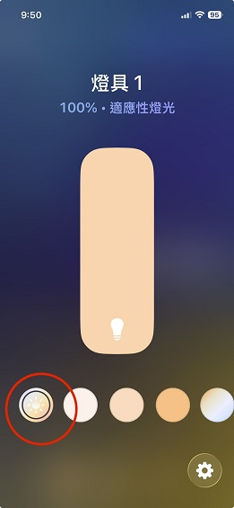

## 產品介紹 110V 供電 Only

### 接線與走線規劃建議 注意: *AC/DC變壓器負責燈具供電；AC L、N、S1、S2僅供控制開關電燈使用*

### 燈具瓦數與交流轉直流變壓器換算方式

## 開始使用啟動連網模式

### 接入自家網路(WIFI)
### ESPHome 版本 (HA ONLY)
 * 重置後手機靠近設備找wifi熱點 automate-lt-cw-xxxxxx，接入後等待數秒手機自動跳轉引導畫面選擇wifi名城與密碼存檔完成。(若沒自動切換可瀏覽器輸入192.168.4.1)。
### mater 版本 (HA HK)
 * HA 硬體進入連網模式，手機打開HA app 設定 > Matter > 新増裝置 (若沒接入 HK 選 "全新"，若已接入 HK 選 "正在使用") > 掃描條碼或輸入配對碼 3642-630-6820
 * HK 硬體進入連網模式，打開手機的相機app掃二維碼即可。或打開 apple 家庭加入配件 >  掃二維碼 或 輸入配對碼 3642-630-6820
 * HA、HK 雙支援 (若是HA HK同時存在，建議先進HA在分享給HK)
 * HA 設定 > matter > 裝置 > 分享產生配對碼> HK 新增配件 > 輸入配對碼完成。
### Homekit 版本自適應燈光設置
* 依據當地時間自適應調整燈光色溫、亮度的功能。
* Homekit 畫面點選 "適應性燈光" 即可。
* 
### Homekit版本自適應畫面說明

### ESPHome版本自適應燈光設置
* 請安裝HA的自適應燈光插件，並按說明設置即可。

