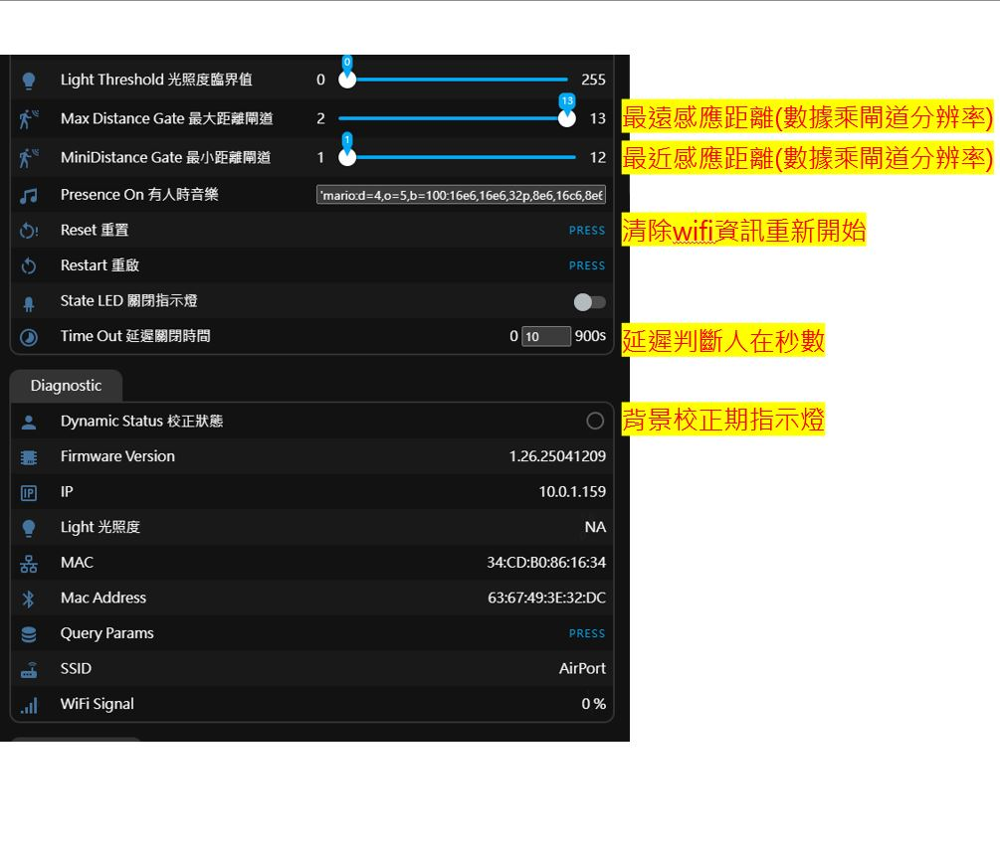
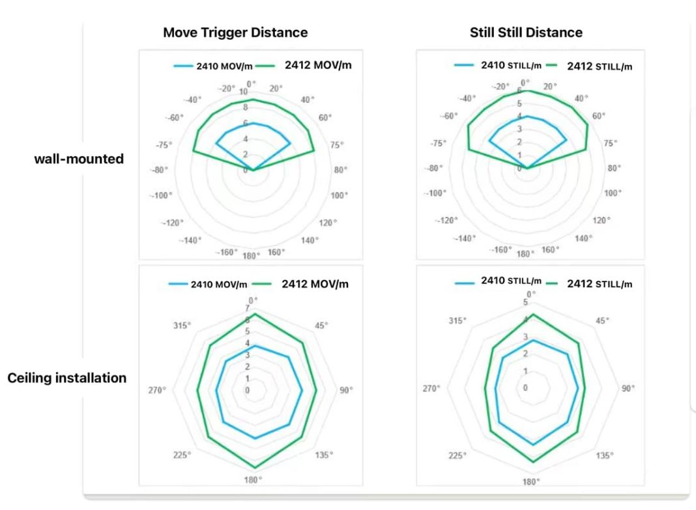

## 使用說明
### 重置 wifi
- 長按5秒重開，10秒重置進入連網模式

### 接入網路
- 進入連網模式後手機搜尋產品發出的熱點 motionone-plus-xxxxxx 連接後靜待幾秒會跳出輸入wifi SSID 與密碼的畫面，或手動切換到瀏覽器輸入192.168.414即可。
### 接入 HA
- 連網成功HA會自動發現導入即可
### 開始使用步驟

- 接入wifi
- 開啟後台ip網頁或接入HA於ESPHome中找到設備頁面
- 將產品固定在預計的位置並調好角度(電源線固定好避免晃動)
- 保持雷達涵蓋範圍沒有干擾物
- 離開現場按下 "動態背景偵測"鍵(此時會有警示蜂鳴器聲音)
- 稍待片刻當第二次蜂鳴器響起代表完成。
- 開始使用或調整角度再次 "動態背景偵測" 按下....
     
### 重點提醒
- 重點提醒: 主要判斷偵測實體是 "Presence人在感應" 這個實體，他會參照現場光照度設置參數決定是否有效，若不需要光照判斷請選off。
- 光照度調整步驟: 選擇判斷 "光照模式" 條件打開 "工程模式" 後 "Lighte光照度" 開始顯示現場照度，依據該照度調整 "光照度臨界值" 來作為是否判斷有人的依據。
- 例如光照低於20人在感應偵測到有人才生效等。
- "距離閘道分辨率" 乘以 "最大距離閘道" 等於最遠偵測距離。 "距離閘道分辨率" 乘以 "最小距離閘道" 等於最近偵測距離，這兩個數據 "涵蓋的範圍" 就是雷達偵測有效距離。

### Motion One(LD2410) vs Plus(LD2412) 偵測範圍說明(請見綠色線條)

原廠雷達感應元件詳細說明  https://drive.google.com/drive/folders/17TAVgH5YI_6naA24dpjnJjm2v28alRPl?usp=sharing
