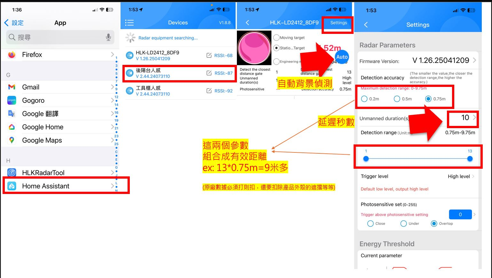

### 1. 手機下載 HLKRadarTool app並打開藍牙。

### 2. 選擇 HLK-LD2412_xxxx

### 3. 輸入密碼進入設定頁面(密碼就在頁面上)。

### 4. 感測器固定好位置與角度(USB線避免晃動)。

### 5. 清場。

### 6. 按下主頁 auto 開始背景偵測。

### 7. 開始動態偵測環境背景值 (會有提示音)。

### 8. 稍待片刻再次響起提示音即完成。

### 9. 人體實驗，進入偵測區驗證效果。

### 10. 重複步驟4直到滿意為止。

### 注意事項提醒。
- 調適階段可以吧timeout秒數縮小減少判斷沒人的時間，以下幾個參數可自由調整，其餘建議不要動以免調亂了。
- 主畫面綠燈沒人紅燈有人。
- 找到安裝甜蜜點以後請適時延長 "延遲秒數" 例如 60秒降低誤判機率。

