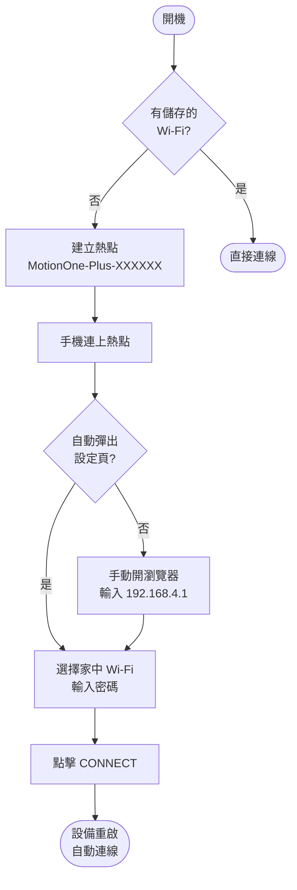
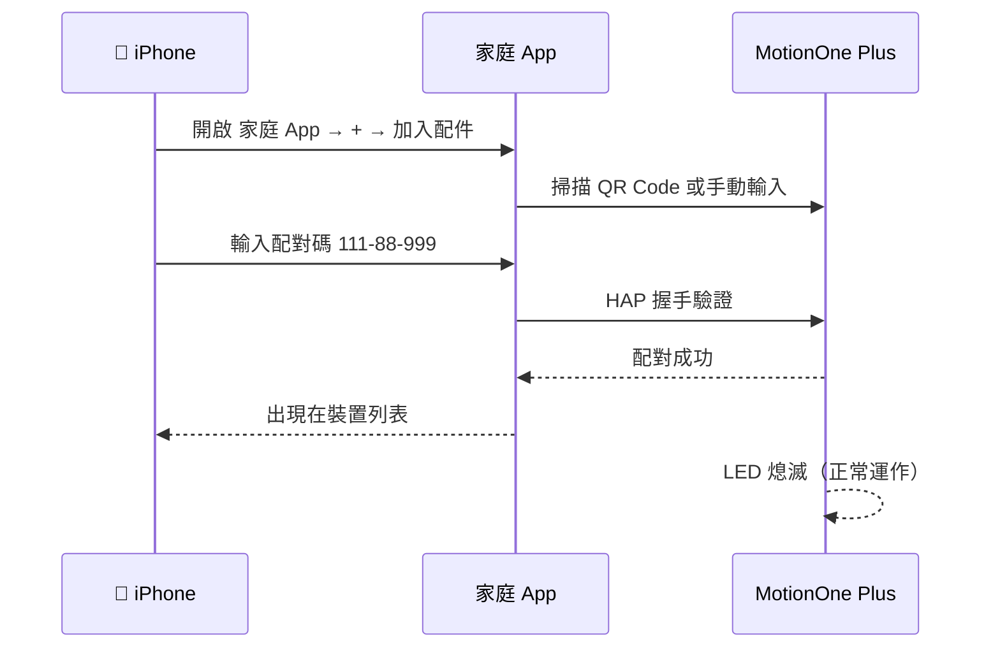
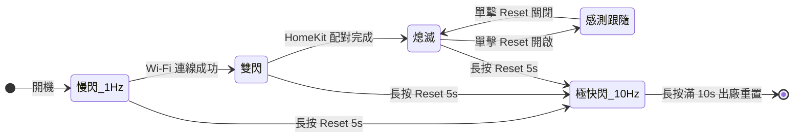
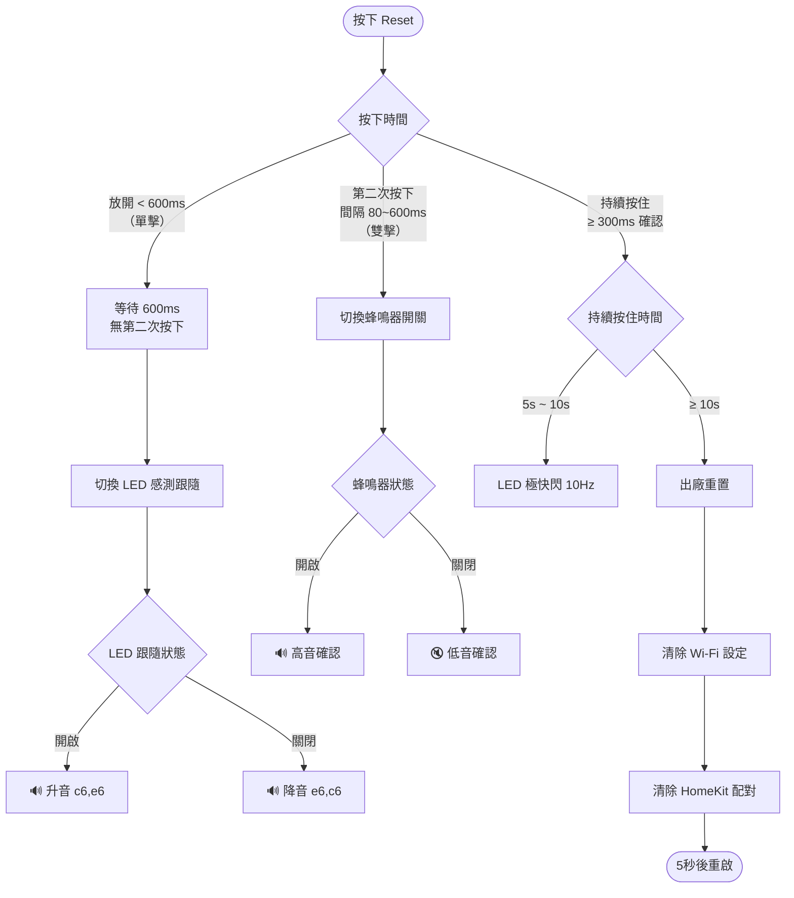
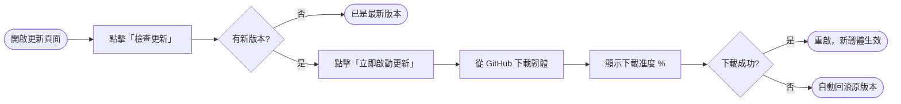

# MotionOne Plus　人體存在感應器

> **毫米波雷達 × Apple HomeKit × OTA 自動更新**
> 版本：`1.1.18` ｜ 韌體由 ESP32-C3 驅動

---

## 目錄

- [產品核心特性](#features)
- [硬體一覽](#hardware)
- [初次使用 Wi-Fi 設定](#wifi-setup)
- [HomeKit 配對指南](#homekit-pairing)
- [LED 狀態指示燈](#led-status)
- [Reset 按鍵完整操作](#reset-button)
- [蜂鳴器提示音](#buzzer)
- [韌體更新 OTA](#ota)
- [版本記錄](#changelog)

---

<a id="features"></a>
## 🚀 產品核心特性

| 特性 | 說明 |
|------|------|
| 原生 HomeKit | 無需網關，直接接入 Apple「家庭」App |
| 毫米波雷達 LD2412 | 靜止人體也能偵測，解決 PIR 感應器熄燈問題 |
| 自動彈出設定頁 | 接入熱點後自動觸發 iOS / Android Captive Portal |
| Wi-Fi 掃描 | 設定頁面內建 Wi-Fi 掃描，一鍵選取家中網路 |
| 雲端 OTA 更新 | 本地網頁後台一鍵升級，失敗自動回滾 |
| LED 感測跟隨 | 有人→燈亮、無人→燈滅，免開 App 確認感測狀態 |
| 蜂鳴器靜音 | 雙擊 Reset 可隨時開關偵測提示音 |

---

<a id="hardware"></a>
## 🔧 硬體一覽

```
┌─────────────────────────────────────────┐
│              MotionOne Plus             │
│                                         │
│  ┌──────────┐        ┌──────────────┐   │
│  │ LD2412   │──GPIO4─│  ESP32-C3    │   │
│  │ 毫米波   │        │              │   │
│  │ 雷達模組 │        │  GPIO3  LED  │   │
│  └──────────┘        │  GPIO7  蜂鳴 │   │
│                      │  GPIO10 RST  │   │
│                      └──────────────┘   │
│                                         │
│  [ LED ]  [ 蜂鳴器 ]  [ Reset 按鍵 ]   │
└─────────────────────────────────────────┘
```

| 接腳 | 功能 |
|------|------|
| GPIO 3 | 狀態 LED |
| GPIO 4 | LD2412 訊號輸入 |
| GPIO 7 | 蜂鳴器（LEDC PWM） |
| GPIO 10 | Reset 按鍵（內建上拉） |

---

<a id="wifi-setup"></a>
## 🌐 初次使用 Wi-Fi 設定

**LED 每秒閃一次** = 尚未設定 Wi-Fi



**設定步驟：**

1. 搜尋並連接 Wi-Fi 熱點 `MotionOne-Plus-XXXXXX`
2. 系統自動彈出設定網頁（iOS / Android 均支援）
3. 點擊「Scan」掃描家中 Wi-Fi，選取後輸入密碼
4. 點擊「CONNECT」，設備重啟後 LED 轉為雙閃或熄滅 = 連線成功

> 若設定頁未自動彈出，請在瀏覽器輸入 `http://192.168.4.1`

---

<a id="homekit-pairing"></a>
## 📱 HomeKit 配對指南

**LED 雙閃（閃閃‧長滅）** = 已連 Wi-Fi，等待 HomeKit 配對



**配對步驟：**

1. 開啟 iPhone 上的 **Apple「家庭」App**
2. 點右上角 **＋ → 加入配件**
3. 掃描下方 QR Code 或點「我沒有代碼或無法掃描」

```
 ██████████████  ████  ██████████████
 ██          ██  ████  ██          ██
 ██  ██████  ██   ██   ██  ██████  ██
 ██  ██████  ██        ██  ██████  ██
 ██  ██████  ██  ████  ██  ██████  ██
 ██          ██  ████  ██          ██
 ██████████████  ████  ██████████████

       配對碼：111-88-999
```

4. 在「我的配件」選取 `MotionOne-Plus-XXXXXX`
5. 輸入配對碼 **`111-88-999`**
6. 分配房間，完成！

---

<a id="led-status"></a>
## 💡 LED 狀態指示燈



| 燈號 | 節奏 | 含義 |
|------|------|------|
| 慢閃 | 亮 500ms / 滅 500ms（1Hz） | 尚未連網 |
| 雙閃 | 亮400 滅300 亮400 滅1500ms | 已連 Wi-Fi，未 HomeKit 配對 |
| 常滅 | — | **正常運作中** |
| 感測跟隨 | 偵測到人→亮 / 無人→滅 | 正常運作 + LED 跟隨模式 ON |
| 極快閃 | 亮 50ms / 滅 50ms（10Hz） | 長按 Reset 5～10 秒，即將重置 |

---

<a id="reset-button"></a>
## 🛠️ Reset 按鍵完整操作



| 操作 | 效果 | 回饋 |
|------|------|------|
| 單擊（< 600ms） | 切換 LED 感測跟隨 ON/OFF | 蜂鳴器升音／降音 |
| 雙擊（間隔 80~600ms） | 切換蜂鳴器 ON/OFF | 蜂鳴器高音／低音確認 |
| 長按 5s | — | LED 開始極快閃，提示進入重置倒計時 |
| 長按 10s | **出廠重置**，清除 Wi-Fi + HomeKit 配對 | LED 停閃後重啟 |

> **放開按鍵（未達 10 秒）**：LED 自動恢復長按前的原本狀態。

---

<a id="buzzer"></a>
## 🎵 蜂鳴器提示音

| 場景 | 旋律 |
|------|------|
| 偵測到人體進入 | 瑪利歐主題旋律 🎮 |
| 人體離開 | 短促兩聲 |
| 單擊 Reset（LED 跟隨 ON） | 升音 C→E |
| 單擊 Reset（LED 跟隨 OFF） | 降音 E→C |
| 雙擊 Reset（蜂鳴器 ON） | 高音確認音 |
| 雙擊 Reset（蜂鳴器 OFF） | 低音確認音 |

> 蜂鳴器與 LED 跟隨模式設定均儲存於 NVS，重啟後自動恢復。

---

<a id="ota"></a>
## 🔄 韌體更新 (OTA)

設備連網後，瀏覽器開啟更新頁面：

```
http://motionone-plus-xxxxxx.local:8080/update
```

或使用 IP 位址：

```
http://192.168.x.x:8080/update
```



| 功能 | 說明 |
|------|------|
| 版本比對 | 自動比對 GitHub 最新版本號 |
| 進度顯示 | 即時顯示下載百分比 |
| System Console | 即時 Log 輸出 |
| RAM 監控 | 顯示剩餘可用記憶體 |
| CPU 溫度 | 顯示晶片溫度（°C） |

---

<a id="changelog"></a>
## 📋 版本記錄

| 版本 | 主要變更 |
|------|----------|
| 1.1.18 | Captive Portal 改為標準 302 redirect，新增 Android/Windows 偵測 URL |
| 1.1.18 | OTA 檢查修正 dangling pointer（`latest_ver` 本地 buffer） |
| 1.1.18 | OTA `json_buf` 改 stack 分配，減少 heap 碎片 |
| 1.1.14 | Wi-Fi 重連改用 `esp_timer` 排程，避免阻塞 event task |
| 1.1.14 | HomeKit SRP 驗證器完整性檢查，防止配對時 HAPFatalError |

---

© 2026 AUTOMATE 智慧系統


# MotionOne Plus 人體存在感應器 (HomeKit 專用)

歡迎使用 **MotionOne Plus**！這是一款基於先進毫米波雷達技術 (LD2412) 的原生 Apple HomeKit 人體存在感應器，專為追求極致反應速度與偵測精準度的智慧家庭所設計。

## 🚀 產品核心特性

*   **原生 Apple HomeKit 支援**：無需額外網關或橋接器，直接連入 Apple 「家庭」App。
*   **毫米波雷達偵測 (LD2412)**：不僅能偵測移動，更能偵測人體靜止存在，解決傳統 PIR 感應器在人不動時會熄燈的痛點。
*   **網頁化 Wi-Fi 設定**：透過手機輕鬆連接設備熱點即可完成網路配對。
*   **動態 OTA 更新**：透過本地網頁後台即可輕鬆升級最新韌體。
*   **優化 LED 狀態顯示**：精確反饋連網與配對狀態，正常運作時燈號自動熄滅不滋擾。
*   **LED 感測跟隨模式**：可開啟「偵測到人→燈亮，無人→燈滅」的即時視覺回饋，方便在未開啟 HomeKit App 的情況下確認感測器是否正常運作。
*   **可自定義音效反饋**：內建蜂鳴器，可根據需求開啟或關閉偵測提示音。

---

## 🌐 初次使用與 Wi-Fi 設定

如果您的感應器 LED 正在每秒閃一次，代表需要設定網路：

1.  拿起手機搜尋 Wi-Fi 熱點：`MotionOne-Plus-XXXXXX`。
2.  連接熱點後，通常會自動彈出設定網頁（若未彈出，請在瀏覽器輸入 `192.168.4.1`）。
3.  點擊「Scan」掃描家中 Wi-Fi 並輸入密碼。
4.  點擊「CONNECT」，設備重啟後若 LED 轉為雙閃或熄滅，代表連網成功。


---

## 📱 HomeKit 配對指南

如果您的感應器 LED 正在閃閃滅、閃閃滅，代表等待接入Homekit：

1.  開啟 iOS 設備上的 **Apple 「家庭」App**。
2.  點擊右上角 **+** -> **加入配件**。
3.  手機掃描QR-Code或點擊下方「我沒有代碼或無法掃描」。
4.  在「我的配件」清單中選擇 `MotionOne-Plus-XXXXXX`。
5.  **輸入配對碼：`111-88-999`**
6.  等待完成設定，您可以將其分配至指定房間。


---

## 💡 LED 狀態指示燈

| 燈號狀態 | 代表含義 |
| :--- | :--- |
| **慢閃 (1Hz)** | 尚未連網（等待 Wi-Fi 設定） |
| **雙閃 (兩快一長滅)** | 已連上 Wi-Fi，但**尚未配對**至 HomeKit |
| **熄滅 (OFF)** | **正常運作中**（已連網且已完成 HomeKit 配對） |
| **常亮** | 正常運作中 + **LED 感測跟隨模式 ON** + 偵測到人 |
| **極快閃 (10Hz)** | 重置模式（長按 Reset 按鍵中） |

> **LED 感測跟隨模式**：配對完成後，可透過單擊 Reset 鍵開啟此模式。開啟後 LED 將即時反映感測狀態（有人常亮、無人熄滅），作為不依賴手機的本地視覺回饋。

---

## 🛠 硬體操作說明

### 1. Reset 按鍵功能

| 操作 | 效果 |
| :--- | :--- |
| **單擊** | 切換「LED 感測跟隨模式」開啟／關閉（若蜂鳴器開啟，會發出升降音效確認） |
| **連續快按兩下 (Double Click)** | 切換「偵測提示音」開啟／關閉（設備會發出提示音確認） |
| **長按 5～10 秒** | LED 極快閃，提示即將進入重置 |
| **長按 10 秒以上** | 執行「恢復出廠設定」，清除所有 Wi-Fi 憑據與 HomeKit 配對資訊 |

> **恢復出廠狀態**：長按按鍵直到指示燈出現快閃後持續到快閃停止即完成。

### 2. 蜂鳴器提示音
*   **瑪利歐旋律**：偵測到人體進入。
*   **短促兩聲**：人體離開。
*   *(提示：可透過雙擊 Reset 鍵隨時靜音)*

---

## 🔄 韌體更新 (OTA)

本設備支援雲端 OTA 自動更新。設備連網後，在瀏覽器輸入以下網址開啟更新頁面：

```
http://motionone-plus-xxxxxx.local:8080/update
```
或使用 IP 位址：
```
http://192.168.x.x:8080/update
```

頁面會自動比對 GitHub 上的最新版本：
*   若有新版本，點擊「**立即啟動更新**」即可自動從雲端下載並更新。
*   更新完成後裝置將自動重啟，若失敗則自動回滾至原本版本。
*   頁面內建 **System Console**，可即時查看裝置 Log、剩餘記憶體 (RAM) 及 CPU 溫度。

---
© 2026 AUTOMATE 智慧系統.
