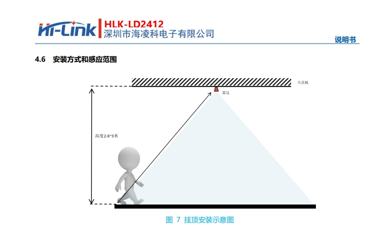
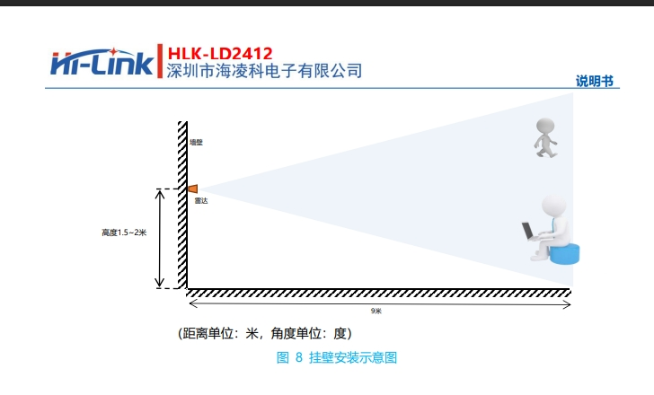

<!-- MotionOne README — Argon-style (Automate brand navy + orange, clean white hero) -->
<!-- 2026-05-26:套用 AirFan / LTC3 統一視覺;hero 白底 + AUTOMATE logo SVG;影片改縮圖點擊。 -->

<!-- AUTOMATE Logo (inline SVG,height 64px) -->
<svg width="320" height="55" viewBox="0 0 1412.26 241.88" xmlns="http://www.w3.org/2000/svg" aria-label="AUTOMATE">
  <g fill="none" stroke-miterlimit="10">
    <g stroke="#ff6f48" stroke-width="8">
      <circle cx="21.02" cy="86.69" r="17.02"/>
      <polyline points="77.94 240.38 77.94 155.97 31.96 100.72"/>
      <circle cx="72.84" cy="21.02" r="17.02"/>
      <polyline points="101.21 240.38 101.21 145.93 72.92 117.64 72.92 38.03"/>
      <circle cx="124.98" cy="73.74" r="17.02"/>
      <line x1="124.98" y1="240.38" x2="124.98" y2="90.75"/>
      <circle cx="178.3" cy="94.21" r="17.02"/>
      <polyline points="147.26 240.38 147.26 191.36 178.56 160.07 178.56 111.23"/>
    </g>
    <g><line stroke="#33506d" stroke-width="3" x1="207.25" y1="240.38" x2="1411.2" y2="240.38"/></g>
  </g>
  <g fill="#33506d" stroke-width="0">
    <path d="M426.04,209.58c-20.58,0-36.67-6.59-48.27-19.77-11.6-13.18-17.4-32.08-17.4-56.69V39.98h33.77v92.18c0,15.72,2.83,27.12,8.49,34.18,5.66,7.07,13.53,10.6,23.62,10.6s18.16-3.53,23.83-10.6c5.66-7.06,8.49-18.46,8.49-34.18V39.98h32.94v93.14c0,24.62-5.8,43.51-17.4,56.69-11.6,13.18-27.62,19.77-48.06,19.77Z"/>
    <path d="M552.37,206.72V71.42h-41.04v-31.44h111.76v31.44h-41.04v135.3h-29.68Z"/>
    <path d="M718.05,209.58c-11.9,0-22.87-2.14-32.9-6.43-10.04-4.29-18.78-10.32-26.23-18.1-7.45-7.78-13.22-16.91-17.31-27.39-4.09-10.48-6.13-21.91-6.13-34.3s2.04-24.02,6.13-34.42c4.08-10.4,9.85-19.49,17.31-27.27,7.45-7.78,16.16-13.82,26.13-18.1,9.96-4.29,20.89-6.43,32.79-6.43s22.82,2.11,32.79,6.31c9.96,4.21,18.67,10.21,26.12,17.98,7.45,7.78,13.22,16.91,17.31,27.39,4.08,10.48,6.13,22,6.13,34.54s-2.04,23.86-6.13,34.42c-4.09,10.56-9.86,19.73-17.31,27.51-7.45,7.78-16.16,13.78-26.12,17.98-9.97,4.21-20.82,6.31-32.58,6.31ZM717.83,176.95c6.74,0,12.93-1.31,18.6-3.93,5.66-2.62,10.64-6.35,14.94-11.2,4.3-4.84,7.63-10.48,10-16.91,2.36-6.43,3.55-13.61,3.55-21.56s-1.18-15.13-3.55-21.56c-2.37-6.43-5.7-12.07-10-16.91-4.3-4.84-9.28-8.57-14.94-11.19-5.66-2.62-11.86-3.93-18.6-3.93s-12.98,1.31-18.71,3.93c-5.73,2.62-10.72,6.35-14.94,11.19-4.23,4.85-7.53,10.48-9.89,16.91-2.37,6.43-3.55,13.62-3.55,21.56s1.18,15.12,3.55,21.56c2.36,6.43,5.66,12.07,9.89,16.91,4.23,4.84,9.21,8.57,14.94,11.2,5.73,2.62,11.97,3.93,18.71,3.93Z"/>
    <path d="M813,206.72l20.27-166.74h40.42l32.87,125.81h0l32.73-125.81h40.49l20.34,166.74h-31.96l-8.86-136.97h0l-37.53,138.33h-31.44l-35.59-138.33h0l-11.07,136.97h-30.67Z"/>
    <path d="M1215.57,206.72V71.42h-41.04v-31.44h111.76v31.44h-41.04v135.3h-29.68Z"/>
    <path d="M1312.96,206.72V39.98h96.92v30.97h-67.42v104.81h69.8v30.97h-99.3ZM1340.26,132.23v-30.25h61.74v30.25h-61.74Z"/>
    <path d="M1017.77,207.4l51.06-166.74h41.71l51.06,166.74h-31.15l-47.09-147.21h11.91l-47.09,147.21h-30.41ZM1046.54,171.67l7.51-29.3,64.54-10.65,7.63,27.36-79.68,12.59Z"/>
    <path d="M206.19,206.72l51.06-166.74h41.71l51.06,166.74h-31.15l-47.09-147.21h11.91l-47.09,147.21h-30.41ZM234.95,170.99l7.51-29.3,64.54-10.65,7.63,27.36-79.68,12.59Z"/>
  </g>
</svg>

<h1 style="font-size:42px;font-weight:800;margin:24px 0 6px 0;letter-spacing:-0.025em;color:#1c3d5a">MotionOne</h1>

24 GHz 毫米波雷達 · Matter over Wi-Fi · 跨生態相容

<!-- Matter QR + 11 碼配對碼 並排 -->
<table align="center" style="margin:28px auto 0;border-collapse:collapse;border:none">
<tr>
<td align="center" style="border:none;padding:0 20px;vertical-align:middle">
  
  
Matter 配對 QR Code

</td>
<td align="left" style="border:none;padding:0 20px;vertical-align:middle">
  
11 碼配對碼

  
3642-630-6820

  
掃描左側 QR Code 即可自動配對 或在 App 中手動輸入 11 碼

</td>
</tr>
</table>

<!-- 影片區:YouTube thumbnail 點擊播放(GitHub 不允許 iframe,thumbnail 是極限) -->

  ⬆️ 重置進入連網模式 · HA → Apple Home · Apple Home → HA · 毫米波參數調整 ⬆️

<blockquote style="border-left:4px solid #007AFF;background:#eff7ff;padding:14px 18px;margin:16px auto;border-radius:0 12px 12px 0;color:#1c3d5a;max-width:880px">
📖 毫米波參數調整文字說明:<a href="https://github.com/Billtou/public/tree/main/Motion_One_Plus/HLKRadarTool"><b>原廠 App 使用說明</b></a>
</blockquote>

---

<b>📑 目錄</b>

1. [產品簡介](#1-產品簡介)
2. [硬體說明](#2-硬體說明)
3. [LED 狀態指示](#3-led-狀態指示)
4. [按鍵操作](#4-按鍵操作)
5. [接入智能生態(初次配對)](#5-接入智能生態初次配對)
6. [跨生態接入(Matter Multi-Admin)](#6-跨生態接入matter-multi-admin)
7. [Web UI 進階設定](#7-web-ui-進階設定)
8. [蜂鳴器與 LED 偏好](#8-蜂鳴器與-led-偏好)
9. [OTA 韌體更新](#9-ota-韌體更新)
10. [工廠重置](#10-工廠重置)
11. [故障排除](#11-故障排除)
12. [安全使用](#12-安全使用)
13. [規格表](#13-規格表)
14. [附錄:雷達安裝與涵蓋範圍](#14-附錄雷達安裝與涵蓋範圍)

---

<h2 style="color:#1c3d5a;border-bottom:3px solid #ff6f48;padding-bottom:8px;margin-top:48px;font-size:28px">1. 產品簡介</h2>

MotionOne 是 AUTOMATE 推出的智能人體感測器,使用 **24 GHz 毫米波雷達**取代傳統 PIR(被動紅外線),**直接接入 Apple Home / Google Home / Home Assistant / SmartThings / Alexa**,不需專屬 Hub。

<table style="width:100%;border-collapse:separate;border-spacing:8px;margin:16px 0">
<tr><td width="50%" style="background:#fff;padding:18px;border-radius:14px;border:1px solid #e5e7eb;box-shadow:0 2px 8px rgba(0,0,0,0.04)">

🛋️ 靜止偵測

即便人在沙發上不動也偵測得到「有人」,不像 PIR 只看動作

</td>
<td width="50%" style="background:#fff;padding:18px;border-radius:14px;border:1px solid #e5e7eb;box-shadow:0 2px 8px rgba(0,0,0,0.04)">

🌡️ 不受溫度影響

不會因為夏天高溫或冷氣冷風誤觸

</td></tr>
<tr><td style="background:#fff;padding:18px;border-radius:14px;border:1px solid #e5e7eb;box-shadow:0 2px 8px rgba(0,0,0,0.04)">

📐 可穿透薄塑膠 / 玻璃

安裝彈性高,可藏於櫃內 / 燈具內

</td>
<td style="background:#fff;padding:18px;border-radius:14px;border:1px solid #e5e7eb;box-shadow:0 2px 8px rgba(0,0,0,0.04)">

🌐 Matter 標準協定

不需專屬 Hub,直接加入主流智能家居生態

</td></tr>
</table>

### 1.1 規格速覽

| 項目 | 內容 |
|---|---|
| 感測技術 | 24 GHz mmWave Radar(HLK-LD2412)|
| 偵測距離 | 0.75 m – 9 m |
| 偵測角度 | 水平 ±60° / 垂直 ±35° |
| 通訊協定 | Matter 1.x over Wi-Fi |
| Wi-Fi | 2.4 GHz 802.11 b/g/n(不支援 5 GHz)|
| BLE | 5.0(僅配對用)|
| 供電 | DC 5V / USB-C,建議 ≥ 1 A |
| 工作環境 | 0–50 °C / 10–90% RH(無凝結) |

### 1.2 包裝內容

- MotionOne 主機 × 1
- 安裝雙面膠 × 1
- 快速入門卡(含 Matter QR Code 與 11 碼配對碼)× 1

---

<h2 style="color:#1c3d5a;border-bottom:3px solid #ff6f48;padding-bottom:8px;margin-top:48px;font-size:28px">2. 硬體說明</h2>

### 2.1 外觀與接口

- **狀態 LED**:單色 LED,顯示 Wi-Fi / 配對 / 動作偵測狀態(章節 3)
- **按鍵**:多功能按鈕,支援雙擊 / 長按(章節 4)
- **USB-C**:供電(資料線無作用,單純取電)

### 2.2 配對碼資訊

| 項目 | 數值 |
|---|---|
| Matter QR Code | 機身底部標籤 |
| 11 碼手動配對碼 | `3642-630-6820` |
| 預設裝置名稱 | `MotionOne-XXXXXX`(後 6 碼為機身唯一識別)|

<blockquote style="border-left:4px solid #007AFF;background:#eff7ff;padding:14px 18px;margin:16px 0;border-radius:0 12px 12px 0;color:#1c3d5a">
💡 配對碼遺失時,可在 Web UI(章節 7)首頁查看。
</blockquote>

---

<h2 style="color:#1c3d5a;border-bottom:3px solid #ff6f48;padding-bottom:8px;margin-top:48px;font-size:28px">3. LED 狀態指示</h2>

### 3.1 4 種運作狀態

依優先級從高到低:

| 優先級 | 狀態 | LED 行為 | 含義 |
|---|---|---|---|
| 1 | 重置警告 | 5 Hz 快閃(亮 0.1s 暗 0.1s)| 按鍵已按 5 秒,再 5 秒進入工廠重置 |
| 2 | 等待 Wi-Fi | 1 Hz 慢閃(亮 0.5s 暗 0.5s)| 尚未配對 / Wi-Fi 連不上 |
| 3 | 配對中 | 雙閃(快兩下停一下)| Wi-Fi 已連,Matter commissioning 進行中 |
| 4 | 正常運作 | 熄滅(或跟隨偵測)| 一切就緒 |

### 3.2 快速判斷對照表

| 看到 LED | 通常代表 | 該做什麼 |
|---|---|---|
| 慢閃 | 沒設定過 / 重置後 | 用手機 App 配對流程加入 |
| 雙閃 | 配對流程進行中 | 等 30 秒;超過 1 分鐘還在雙閃 → App 重新加入 |
| 熄滅 | 已上線運作中 | 無需處理 |
| 偵測到人時亮起 | 已啟用「LED 跟隨動作」| 正常,可在 Web UI 或按鍵關閉 |
| 快閃 | 你正在長按按鍵 | 想取消重置就放開;想重置就按到 10 秒 |

---

<h2 style="color:#1c3d5a;border-bottom:3px solid #ff6f48;padding-bottom:8px;margin-top:48px;font-size:28px">4. 按鍵操作</h2>

### 4.1 日常快捷鍵(細針戳主機面板小洞)

| 操作 | 功能 | 蜂鳴器回饋 |
|---|---|---|
| **雙擊**(0.6 秒內快速兩下)| 切換**蜂鳴器**開 / 關 | 短促高音(開)/ 短促低音(關)|
| **單擊長按 ≈ 0.6–5 秒** | 切換**LED 跟隨動作**開 / 關 | 兩聲短旋律 |

### 4.2 工廠重置(細針戳主機面板小洞)

| 動作 | 結果 |
|---|---|
| 持續按到 10 秒以上 | **工廠重置觸發**,LED 熄滅,裝置自動重啟 |

> 重置範圍見 [章節 10.3](#103-重置會清除什麼)。

---

<h2 style="color:#1c3d5a;border-bottom:3px solid #ff6f48;padding-bottom:8px;margin-top:48px;font-size:28px">5. 接入智能生態(初次配對)</h2>

### 5.1 配對前確認

- [ ] 路由器 **Wi-Fi 2.4 GHz** 可用(MotionOne 不支援 5 GHz)
- [ ] 手機 **藍牙開啟**,跟 MotionOne 距離 < 1 公尺
- [ ] 手機**已加入** Matter 平台(Apple Home / Google Home / SmartThings / Alexa)
- [ ] 至少有一台 Matter Controller 在線:
  - **Apple**:iPhone / iPad / HomePod / Apple TV(iOS 16.1+)
  - **Google**:Nest Hub / Android 14+ 手機
  - **Home Assistant**: 主機 / iPhone / Android 14+ 手機
  - **Alexa**:Echo Hub / Echo (4th gen) / Echo Show

### 5.2 Apple Home

1. 通電 MotionOne,等 LED 開始**慢閃**
2. iPhone 開「家庭」App → 右上角 **+** → **加入配件**
3. 對準 QR Code 掃描;或選「沒有代碼/無法掃描」→ 輸入 `3642-630-6820`
4. iPhone 自動傳 Wi-Fi 憑證 → LED 變**雙閃**
5. 配對完成 → LED **熄滅**,出現「MotionOne-XXXXXX」

### 5.3 Home Assistant

1. 通電,等 LED 慢閃
2. 開 Home Assistant App → 設定 → Matter → 新增裝置 → 全新的裝置
3. 掃 QR 或輸入 `3642-630-6820`
4. App 自動完成

### 5.4 Google Home

1. 通電,等 LED 慢閃
2. 開「Google Home」App → 右上 **+** → **設定裝置** → **新裝置** → 選擇家庭
3. App 自動偵測「Matter 裝置」→ 點擊 → 掃 QR 或輸入 `3642-630-6820`
4. 依 App 指示完成 Wi-Fi 設定
5. 配對完成,可在「動作感測器」分類找到

### 5.5 Amazon Alexa

1. 通電,等 LED 慢閃
2. 開 Alexa App → 裝置 → **+** → **新增裝置** → **其他** → **Matter**
3. 掃 QR 或輸入 `3642-630-6820`
4. 完成

---

<h2 style="color:#1c3d5a;border-bottom:3px solid #ff6f48;padding-bottom:8px;margin-top:48px;font-size:28px">6. 跨生態接入(Matter Multi-Admin)</h2>

### 6.1 機制說明

Matter 規範允許**同一台裝置同時加入多個生態**,最多 **5 個 Fabric**。例如同時被 Apple Home 與 Home Assistant 控制,動作偵測會同步出現在兩個 App。

<blockquote style="border-left:4px solid #ff6f48;background:#fff7f4;padding:14px 18px;margin:16px 0;border-radius:0 12px 12px 0;color:#5a3520">
⚠️ <b>關鍵原則</b>:第二個生態起,<b>不能用出廠那組 <code>3642-630-6820</code></b> — 必須由<b>第一個已配對的生態</b>產生一組「分享配對碼」(每次新的、有時效)。
</blockquote>

### 6.2 從 Apple Home 分享給其他生態

1. 家庭 App → 長按裝置 → **設定**(齒輪圖示)
2. 滑到底,找 **「開啟配對模式」**或 **「橋接器 > 開啟配對模式」**
3. App 顯示一組 11 碼**拷貝代碼**(15 分鐘內有效)
4. 在第二個生態 App「加入配件」流程輸入這組新碼

### 6.3 從 Home Assistant 分享給其他生態

1. Home Assistant App → 設定 → Matter → 指定轉出裝置 → 分享裝置 **複製代碼**
2. **複製代碼**
3. 在第二個生態 App「加入配件」流程輸入這組新碼

### 6.4 常見誤區

| 誤操作 | 後果 | 正確做法 |
|---|---|---|
| 第二個生態用出廠 `3642-630-6820` | 配對失敗 | 用第一個生態生出來的「分享碼」 |
| 用 Apple 重置裝置後再加入 Google | Apple 那邊也會掉 | 不要重置,用「Multi-Admin 分享」流程 |
| 已加入 5 個生態還想加 | 失敗 | 移除其中一個再加 |
| Wi-Fi 不通就嘗試多 admin | 失敗 | 先確認原配對生態正常,Wi-Fi 通才能分享 |

---

<h2 style="color:#1c3d5a;border-bottom:3px solid #ff6f48;padding-bottom:8px;margin-top:48px;font-size:28px">7. Web UI 進階設定</h2>

### 7.1 連線方式

配對成功後,MotionOne 在區網提供 Web UI。打開瀏覽器,網址兩種擇一:

- **直接 IP**:在生態 App 內查看裝置 IP(例 `http://192.168.1.123`)
- **主機名稱**:`http://automate-motionone-XXXXXX.local`(XXXXXX 為機身 MAC 後 6 碼)

> 手機與 MotionOne 必須在**同一個 Wi-Fi 網段**。

### 7.2 首頁:即時狀態與設定

| 區塊 | 內容 |
|---|---|
| **裝置資訊** | 韌體版本、可用記憶體、運行時間、連線狀態 |
| **即時狀態** | 動作偵測即時值(偵測到 / 未偵測)|
| **蜂鳴器與 LED** | 兩個 toggle 開關 + 「儲存設定」按鈕 |

### 7.3 版更頁:OTA 韌體更新

| 區塊 | 內容 |
|---|---|
| **韌體資訊** | 目前版本、最新版本、檢查狀態 |
| **開始更新按鈕** | 點擊後自動下載 + 安裝 + 重啟(約 1–2 分鐘)|
| **裝置資料清除** | 紅色危險操作,等同硬體長按 10 秒重置 |
| **系統日誌** | 即時 log + RAM / CPU 溫度 |

---

<h2 style="color:#1c3d5a;border-bottom:3px solid #ff6f48;padding-bottom:8px;margin-top:48px;font-size:28px">8. 蜂鳴器與 LED 偏好</h2>

### 8.1 蜂鳴器提示音

預設:**開啟**。偵測到動作時播放短旋律提示。

切換方式:
- **硬體**:雙擊按鍵
- **Web UI**:首頁「蜂鳴器與 LED」card → 「啟用蜂鳴器」toggle → 儲存設定

### 8.2 LED 跟隨動作

預設:**關閉**。開啟後,偵測到動作時 LED 亮起,離開時熄滅。

切換方式:
- **硬體**:單擊長按 ≥ 0.6 秒
- **Web UI**:首頁「蜂鳴器與 LED」card → 「LED 跟隨動作」toggle → 儲存設定

---

<h2 style="color:#1c3d5a;border-bottom:3px solid #ff6f48;padding-bottom:8px;margin-top:48px;font-size:28px">9. OTA 韌體更新</h2>

### 9.1 更新流程

1. 連線 Web UI → 底部 **版更** Tab
2. 系統自動向官方檢查最新版本
3. 若有新版,顯示「有新版本可更新」+ 「開始更新」按鈕
4. 點擊「開始更新」→ 確認對話框 → 自動下載
5. 下載完成自動重啟,Web UI 自動 reload 回首頁

整個過程約 1–2 分鐘,期間裝置會暫時離線。

### 9.2 更新會保留 / 清除什麼

| 項目 | 是否保留 |
|---|---|
| Matter 配對(所有生態)| ✅ 保留 |
| Wi-Fi 帳密 | ✅ 保留 |
| 蜂鳴器 / LED 偏好 | ✅ 保留 |
| 韌體版本 | ❌ 換新版 |

---

<h2 style="color:#1c3d5a;border-bottom:3px solid #ff6f48;padding-bottom:8px;margin-top:48px;font-size:28px">10. 工廠重置</h2>

### 10.1 硬體重置(細針戳主機面板小洞)

- 按住按鍵 **10 秒以上**
- LED 從快閃變熄滅 → 鬆開 → 自動重啟
- 重啟後 LED 慢閃,等待重新配對

### 10.2 Web UI 重置

- 版更頁 → 「裝置資料清除」card → 「清除 NVS(出廠重置)」
- 確認對話框 → 自動重啟

### 10.3 重置會清除什麼

| 項目 | 是否清除 |
|---|---|
| Matter 配對(所有生態)| ✅ 清除 |
| Wi-Fi 帳密 | ✅ 清除 |
| 蜂鳴器 / LED 偏好 | ✅ 重置為預設(蜂鳴開、LED 跟隨關)|
| 韌體版本 | ❌ 不變 |
| 裝置認證資料 / DAC | ❌ 不變(內建出廠憑證,不會掉)|

> 重置後跟全新開封一樣,需重新配對。

---

<h2 style="color:#1c3d5a;border-bottom:3px solid #ff6f48;padding-bottom:8px;margin-top:48px;font-size:28px">11. 故障排除</h2>

### 11.1 配對相關

| 現象 | 原因 | 處理 |
|---|---|---|
| LED 一直慢閃,App 找不到裝置 | 配對流程沒走完 / 手機藍牙關閉 / 距離太遠 | 確認手機藍牙開、距離 < 1 m、Wi-Fi 是 2.4 GHz |
| 雙閃很久最後又回慢閃 + 蜂鳴重響 | 裝置中途重啟(供電不足)| 換較粗 USB 線 / 機殼後方 USB 3.0 直連、不走 hub |
| App 顯示「無法加入」| 配對碼錯誤 / Fabric 已滿 | 重新輸入碼;若已用 5 個生態,先移除其一 |
| 第二個生態加不進 | 用了出廠那組碼 | 改用第一個生態的「分享碼」(章節 6)|

### 11.2 運作相關

| 現象 | 原因 | 處理 |
|---|---|---|
| App 中裝置顯示離線 | Wi-Fi 斷線 / 路由器重啟 | 等 1–2 分鐘自動回連;不行就重新通電 |
| 偵測一直顯示「有人」 | 尚未執行動態背景偵測 | 請見文章一開頭 [毫米波參數調整](https://github.com/Billtou/public/tree/main/Motion_One_Plus/HLKRadarTool)|
| 偵測延遲明顯 | 雷達內部 timeout 過久 | Web UI mmWave 調參(進階使用者)|
| LED 跟隨動作沒反應 | 偏好設定關閉 | Web UI 開啟 toggle 並儲存 |

### 11.3 OTA 相關

| 現象 | 原因 | 處理 |
|---|---|---|
| 版更頁顯示「無法取得版本」| 裝置連不到 GitHub | 檢查網路,可能是 DNS / 網路 / 防火牆問題 |
| 「開始更新」後一直 0% | 下載卡住 | 等 5 分鐘;不行就重啟裝置再試 |
| 更新失敗 | 韌體損毀 / 供電不足 | 重啟裝置(會走舊版),確認供電後重試 |

---

<h2 style="color:#1c3d5a;border-bottom:3px solid #ff6f48;padding-bottom:8px;margin-top:48px;font-size:28px">12. 安全使用</h2>

<blockquote style="border-left:4px solid #007AFF;background:#eff7ff;padding:14px 18px;margin:16px 0;border-radius:0 12px 12px 0;color:#1c3d5a">
💡 雷達 24 GHz 訊號功率極低,<b>長時間使用對人體無害</b>(符合 FCC / NCC / CE 標準)。
</blockquote>

- 請勿拆殼 / 改裝 — 內含高頻電路,改裝會違反電信法規
- 請勿對雷達感測窗噴塗料、貼膠帶、覆蓋金屬,會嚴重影響偵測
- 工作環境溫度 0–50 °C,**勿放置於暖氣 / 廚房灶台旁**
- 戶外使用請另購防水殼

---

<h2 style="color:#1c3d5a;border-bottom:3px solid #ff6f48;padding-bottom:8px;margin-top:48px;font-size:28px">13. 規格表</h2>

| 項目 | 規格 |
|---|---|
| 產品名稱 | MotionOne |
| 品牌 | AUTOMATE |
| 感測技術 | 24 GHz mmWave Radar(HLK-LD2412)|
| 偵測距離 | 0.75 m – 9 m(預設)|
| 偵測角度 | 水平 ±60° / 垂直 ±35° |
| 反應延遲 | < 200 ms(進入)/ 1.5 s(離開,可調)|
| 通訊協定 | Matter 1.x over Wi-Fi |
| Wi-Fi | 2.4 GHz 802.11 b/g/n |
| 藍牙 | BLE 5.0(僅配對)|
| 處理器 | ESP32-C3(RISC-V 32-bit, 160 MHz)|
| Flash | 4 MB |
| 供電 | DC 5V / USB-C(建議 ≥ 1 A)|
| 待機功耗 | < 0.5 W |
| 工作溫度 | 0 °C – 50 °C |
| 工作濕度 | 10% – 90% RH(無凝結)|

---

<h2 style="color:#1c3d5a;border-bottom:3px solid #ff6f48;padding-bottom:8px;margin-top:48px;font-size:28px">14. 附錄:雷達安裝與涵蓋範圍</h2>

---

AUTOMATE · MotionOne · 韌體 v2.3.6(2026-05-01 上市)

