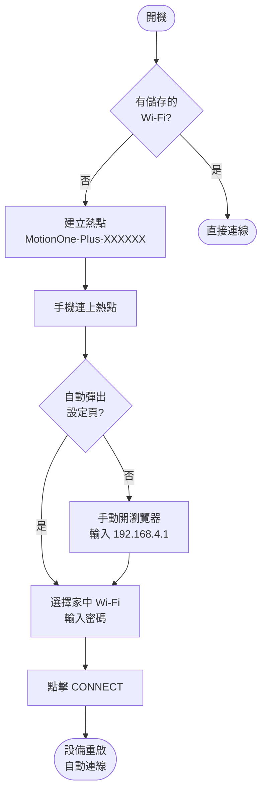
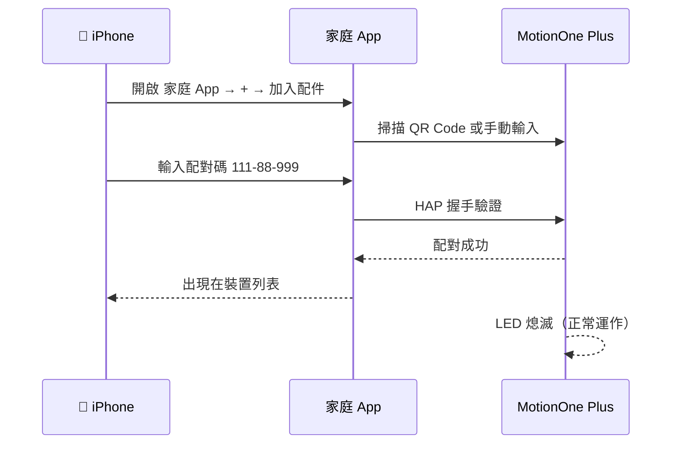
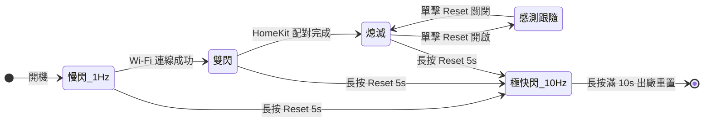
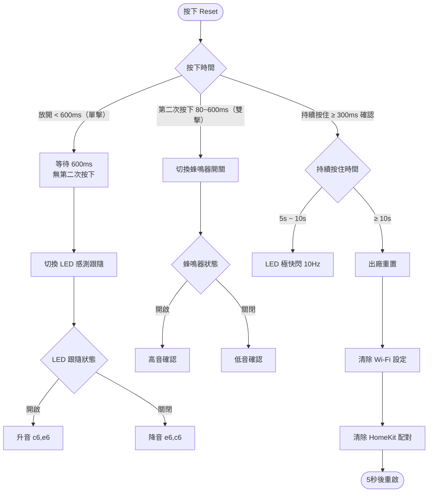
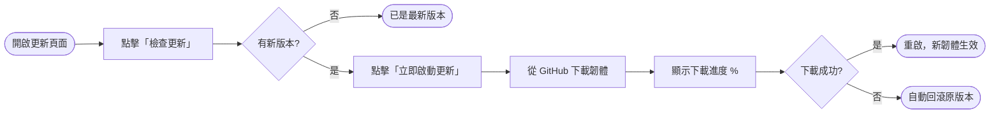

# MotionOne Pro　人體存在感應器

> **毫米波雷達 + PIR × Apple HomeKit × OTA 自動更新**
> 版本：`1.2.0` ｜ 韌體由 ESP32-C3 驅動

---

## 目錄

- [產品核心特性](#features)
- [硬體一覽](#hardware)
- [初次使用 Wi-Fi 設定](#wifi-setup)
- [HomeKit 配對指南](#homekit-pairing)
- [LED 狀態指示燈](#led-status)
- [Reset 按鍵完整操作](#reset-button)
- [蜂鳴器提示音](#buzzer)
- [韌體更新 OTA](#ota)
- [版本記錄](#changelog)

---

<a id="features"></a>
## 🚀 產品核心特性

| 特性 | 說明 |
|------|------|
| 原生 HomeKit | 無需網關，直接接入 Apple「家庭」App |
| 毫米波雷達 LD2412 | 靜止人體也能偵測，解決傳統 PIR 熄燈問題 |
| PIR 感應器補強 | 快速移動偵測，與 LD2412 OR 合併，任一觸發即回報 |
| PIR 30 秒延遲 | PIR 無訊號後延遲 30 秒才確認無人，避免頻繁切換 |
| 自動彈出設定頁 | 接入熱點後自動觸發 iOS / Android Captive Portal |
| Wi-Fi 掃描 | 設定頁面內建 Wi-Fi 掃描，一鍵選取家中網路 |
| 雲端 OTA 更新 | 本地網頁後台一鍵升級，失敗自動回滾 |
| LED 感測跟隨 | 有人→燈亮、無人→燈滅，免開 App 確認感測狀態 |
| 蜂鳴器靜音 | 雙擊 Reset 可隨時開關偵測提示音 |

---

<a id="hardware"></a>
## 🔧 硬體一覽

```
┌──────────────────────────────────────────────┐
│               MotionOne Pro                  │
│                                              │
│  ┌──────────┐        ┌──────────────────┐    │
│  │ LD2412   │──GPIO4─│    ESP32-C3      │    │
│  │ 毫米波   │        │                  │    │
│  │ 雷達模組 │        │  GPIO3  LED      │    │
│  └──────────┘        │  GPIO5  PIR      │    │
│                      │  GPIO7  蜂鳴     │    │
│  ┌──────────┐        │  GPIO10 RST      │    │
│  │ PIR      │──GPIO5─│                  │    │
│  │ 感應器   │        └──────────────────┘    │
│  └──────────┘                                │
│                                              │
│  [ LED ]  [ 蜂鳴器 ]  [ Reset 按鍵 ]        │
└──────────────────────────────────────────────┘
```

| 接腳 | 功能 |
|------|------|
| GPIO 3 | 狀態 LED |
| GPIO 4 | LD2412 mmWave 訊號輸入 |
| GPIO 5 | PIR 感應器輸入（高=有人，30s 延遲離開） |
| GPIO 7 | 蜂鳴器（LEDC PWM） |
| GPIO 10 | Reset 按鍵（內建上拉） |

**感測邏輯：**

| 狀況 | LD2412 | PIR | HomeKit 回報 |
|------|--------|-----|-------------|
| 雙重確認 | 有人 | 有人 | ✅ 有人 |
| 雷達單獨 | 有人 | 無人 | ✅ 有人 |
| PIR 單獨 | 無人 | 有人 | ✅ 有人 |
| 雙重清除 | 無人 | 無人（持續 30s） | ❌ 無人 |

---

<a id="wifi-setup"></a>
## 🌐 初次使用 Wi-Fi 設定

**LED 每秒閃一次** = 尚未設定 Wi-Fi



**設定步驟：**

1. 搜尋並連接 Wi-Fi 熱點 `MotionOne-Plus-XXXXXX`
2. 系統自動彈出設定網頁（iOS / Android 均支援）
3. 點擊「Scan」掃描家中 Wi-Fi，選取後輸入密碼
4. 點擊「CONNECT」，設備重啟後 LED 轉為雙閃或熄滅 = 連線成功

> 若設定頁未自動彈出，請在瀏覽器輸入 `http://192.168.4.1`

---

<a id="homekit-pairing"></a>
## 📱 HomeKit 配對指南

**LED 雙閃（閃閃‧長滅）** = 已連 Wi-Fi，等待 HomeKit 配對



**配對步驟：**

1. 開啟 iPhone 上的 **Apple「家庭」App**
2. 點右上角 **＋ → 加入配件**
3. 掃描下方 QR Code 或點「我沒有代碼或無法掃描」

```
 ██████████████  ████  ██████████████
 ██          ██  ████  ██          ██
 ██  ██████  ██   ██   ██  ██████  ██
 ██  ██████  ██        ██  ██████  ██
 ██  ██████  ██  ████  ██  ██████  ██
 ██          ██  ████  ██          ██
 ██████████████  ████  ██████████████

       配對碼：111-88-999
```

4. 在「我的配件」選取 `MotionOne-Plus-XXXXXX`
5. 輸入配對碼 **`111-88-999`**
6. 分配房間，完成！

---

<a id="led-status"></a>
## 💡 LED 狀態指示燈



| 燈號 | 節奏 | 含義 |
|------|------|------|
| 慢閃 | 亮 500ms / 滅 500ms（1Hz） | 尚未連網 |
| 雙閃 | 亮400 滅300 亮400 滅1500ms | 已連 Wi-Fi，未 HomeKit 配對 |
| 常滅 | — | **正常運作中** |
| 感測跟隨 | 偵測到人→亮 / 無人→滅 | 正常運作 + LED 跟隨模式 ON |
| 極快閃 | 亮 50ms / 滅 50ms（10Hz） | 長按 Reset 5～10 秒，即將重置 |

---

<a id="reset-button"></a>
## 🛠️ Reset 按鍵完整操作



| 操作 | 效果 | 回饋 |
|------|------|------|
| 單擊（< 600ms） | 切換 LED 感測跟隨 ON/OFF | 蜂鳴器升音／降音 |
| 雙擊（間隔 80~600ms） | 切換蜂鳴器 ON/OFF | 蜂鳴器高音／低音確認 |
| 長按 5s | — | LED 開始極快閃，提示進入重置倒計時 |
| 長按 10s | **出廠重置**，清除 Wi-Fi + HomeKit 配對 | LED 停閃後重啟 |

> **放開按鍵（未達 10 秒）**：LED 自動恢復長按前的原本狀態。

---

<a id="buzzer"></a>
## 🎵 蜂鳴器提示音

| 場景 | 旋律 |
|------|------|
| 偵測到人體進入 | 瑪利歐主題旋律 🎮 |
| 人體離開 | 短促兩聲 |
| 單擊 Reset（LED 跟隨 ON） | 升音 C→E |
| 單擊 Reset（LED 跟隨 OFF） | 降音 E→C |
| 雙擊 Reset（蜂鳴器 ON） | 高音確認音 |
| 雙擊 Reset（蜂鳴器 OFF） | 低音確認音 |

> 蜂鳴器與 LED 跟隨模式設定均儲存於 NVS，重啟後自動恢復。

---

<a id="ota"></a>
## 🔄 韌體更新 (OTA)

設備連網後，瀏覽器開啟更新頁面：

```
http://motionone-plus-xxxxxx.local:8080/update
```

或使用 IP 位址：

```
http://192.168.x.x:8080/update
```



| 功能 | 說明 |
|------|------|
| 版本比對 | 自動比對 GitHub 最新版本號 |
| 進度顯示 | 即時顯示下載百分比 |
| System Console | 即時 Log 輸出 |
| RAM 監控 | 顯示剩餘可用記憶體 |
| CPU 溫度 | 顯示晶片溫度（°C） |

---

<a id="changelog"></a>
## 📋 版本記錄

| 版本 | 主要變更 |
|------|----------|
| 1.2.0 | **MotionOne Pro 首版** — 新增 PIR 感應器（GPIO5）|
| 1.2.0 | PIR 30 秒無人延遲機制，避免頻繁切換 |
| 1.2.0 | 雙感測器 OR 合併邏輯（LD2412 + PIR） |
| 1.2.0 | Captive Portal 改為標準 302 redirect |
| 1.2.0 | OTA 修正 dangling pointer 與 heap 碎片問題 |

---

© 2026 AUTOMATE 智慧系統
