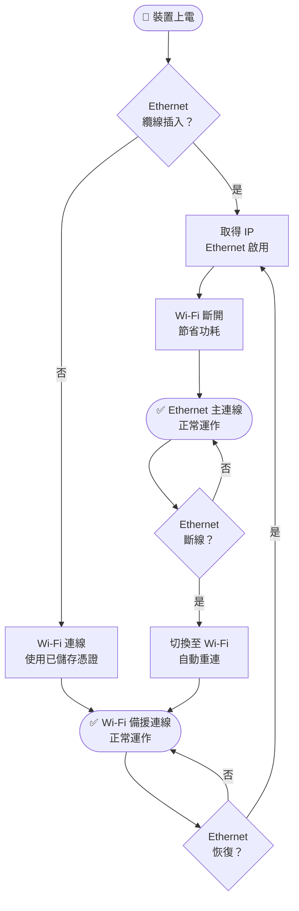

README.md
# Relay-2Way — Matter 雙路繼電器控制器

**Relay-2Way** 是一款支援 **Matter** 標準協議的雙路繼電器控制器，同時具備 **Ethernet（有線網路）** 與 **Wi-Fi（無線網路）** 雙重連線能力，以有線為主、無線自動備援，確保在任何網路環境下穩定運作。可無縫接入 Apple Home、Google Home、Home Assistant 等主流智慧家庭平台。

---

## 目錄

- [產品特色](#產品特色)
- [開箱與首次配對](#開箱與首次配對)
- [接入 Apple Home (HomeKit)](#接入-apple-home-homekit)
- [接入 Home Assistant](#接入-home-assistant)
- [接入 Google Home](#接入-google-home)
- [按鈕與指示燈說明](#按鈕與指示燈說明)
- [網路連線說明](#網路連線說明)
- [韌體更新 OTA](#韌體更新-ota)
- [常見問題](#常見問題)

---

## 產品特色

| 功能 | 說明 |
|---|---|
| 繼電器通道 | 2 路獨立控制，各自對應一個 Matter 端點 |
| 協議 | Matter over Wi-Fi / Ethernet（2.4GHz，WPA2/WPA3） |
| 有線網路 | Ethernet（W5500 SPI），有線優先，Wi-Fi 自動備援 |
| 相容平台 | Apple Home、Google Home、Home Assistant、Amazon Alexa |
| 配網方式 | 藍牙 BLE — 免開 App 直接掃 QR Code 配對 |
| 實體按鈕 | 各通道獨立實體按鈕，可在無網路情況下手動切換 |
| 重啟行為 | 重新上電後繼電器預設**關閉**（OFF），確保安全 |
| 更新方式 | 本地網頁 OTA（連上網路後自動啟動，Port 8080） |
| 電源 | USB-C 5V |

---

## 開箱與首次配對

### 所需準備

- Relay-2Way 本體 × 1
- USB-C 電源線（5V 1A 以上）
- 2.4GHz Wi-Fi 路由器（如使用 Ethernet，需接 RJ-45 網路線）
- 支援 Matter 的手機 App（Apple Home / Google Home / HA Companion）

### 首次上電

1. 接上 USB-C 電源（可選：插入網路線以啟用 Ethernet 連線）
2. 指示燈**慢閃（1 秒閃 1 次）**，表示裝置已進入配對模式
3. 選擇您的平台進行配對（見下方各平台說明）

> **配對碼（Manual Code）** 會於首次開機時印在序列埠輸出。
> 若您的裝置貼有 QR Code 貼紙，直接掃描即可。

---

## 接入 Apple Home (HomeKit)

Relay-2Way 透過 **Matter** 協議接入 Apple Home，**不需要額外的 Home Hub 橋接器**（HomePod mini 或 Apple TV 4K 可選配以獲得遠端控制）。

### 配對步驟

1. 開啟 **「家庭」App**
2. 點擊右上角 **「+」→「新增配件」**
3. 對準裝置上的 **Matter QR Code** 掃描，或選擇「更多選項」手動輸入配對碼
4. 依畫面指示分別命名兩個通道並加入房間
5. 配對完成後，Apple Home 會顯示 **2 個「插座/開關」配件**（各對應一路繼電器）

### 自動化建議

| 觸發條件 | 建議動作 |
|---|---|
| 特定時間到達 | 開啟繼電器 1（例：定時開燈） |
| 感測器觸發 | 開啟繼電器 2（例：偵測到人開啟風扇） |
| 離開家 | 關閉所有繼電器 |
| 深夜 | 自動關閉所有負載 |

---

## 接入 Home Assistant

### 前置條件

- Home Assistant 2023.2 以上
- 已安裝 **Matter（BETA）** 整合
- HA 主機需支援 Matter over Wi-Fi（多數 HA Yellow / Green / 安裝有 Matter Server 的主機均可）

### 配對步驟

1. 確認 Matter Server Add-on 已安裝並啟動
   - 前往 **設定 → 附加元件 → Matter Server → 啟動**
2. 前往 **設定 → 裝置與服務 → 新增整合 → Matter**
3. 點擊「**新增 Matter 裝置**」
4. 選擇「使用 QR Code 或配對碼」輸入配對碼
5. 等待配對完成（約 30–60 秒）
6. 裝置出現於 **整合 → Matter → 裝置**，包含 2 個開關實體：
   - `switch.relay_2way_relay_1`
   - `switch.relay_2way_relay_2`

### 推薦自動化範例（YAML）

```yaml
automation:
  - alias: "定時開啟繼電器 1"
    trigger:
      platform: time
      at: "07:00:00"
    action:
      service: switch.turn_on
      target:
        entity_id: switch.relay_2way_relay_1

  - alias: "離家關閉所有繼電器"
    trigger:
      platform: state
      entity_id: person.home_owner
      to: "not_home"
    action:
      - service: switch.turn_off
        target:
          entity_id:
            - switch.relay_2way_relay_1
            - switch.relay_2way_relay_2
```

---

## 接入 Google Home

1. 開啟 **Google Home App**
2. 點擊右上角 **「+」→「設定裝置」→「新裝置」**
3. 選擇您的家庭 → 搜尋新裝置
4. 掃描 QR Code 或輸入配對碼
5. 配對完成後兩路繼電器分別出現於 Google Home 裝置列表

---

## 按鈕與指示燈說明

### 指示燈（狀態 LED）

| 燈號狀態 | 代表意義 |
|---|---|
| 慢閃（1 Hz） | 等待配對中（未加入任何平台） |
| 恆滅 | 已配對，正常運作中 |
| 快閃（10 Hz） | 長按重置中，即將恢復出廠設定 |

### 繼電器按鈕

| 按鈕 | GPIO | 功能 |
|---|---|---|
| Button 1 | GPIO 2 | 切換 繼電器 1（Relay 1）ON/OFF |
| Button 2 | GPIO 6 | 切換 繼電器 2（Relay 2）ON/OFF |

> 按鈕操作會即時反映至 Matter 平台，手機 App 上的狀態同步更新。

### 重置按鈕

| 操作方式 | 效果 |
|---|---|
| 長按 5–10 秒 | 進入重置預備狀態（LED 快閃） |
| 長按 10 秒以上 | **恢復出廠設定**（清除配對資料，裝置重啟） |

> 恢復出廠設定後，裝置重啟並重新進入等待配對模式（LED 慢閃）。

---

## 網路連線說明

Relay-2Way 同時支援 **Ethernet（有線）** 與 **Wi-Fi（無線）** 兩種連線方式，並採用以下自動切換策略：

### 連線優先順序



| 狀態 | 行為 |
|---|---|
| 僅插入網路線 | 使用 Ethernet，Wi-Fi 斷開 |
| 僅連接 Wi-Fi | 使用 Wi-Fi（Matter BLE 配對取得憑證） |
| 兩者同時存在 | 使用 Ethernet，Wi-Fi 自動斷開節省功耗 |
| Ethernet 斷線 | 自動切換至 Wi-Fi 備援，Matter 連線不中斷 |
| Ethernet 恢復 | 重新連接 Ethernet，Wi-Fi 斷開 |

### 首次使用 Ethernet

若您希望純有線使用（不經過 Wi-Fi 配對），裝置插上網路線後會透過 mDNS 廣播出現在區域網路，Matter 控制器可直接進行「**On-Network（區域網路）配對**」，無需藍牙。

> 建議：首次配對仍透過 BLE（藍牙），之後再插上網路線。裝置會自動偵測並切換至有線連線。

---

## 韌體更新 OTA

Relay-2Way 連上網路（Ethernet 或 Wi-Fi）後會自動在 **Port 8080** 啟動本地更新伺服器。

### 更新步驟

1. 確認電腦 / 手機與裝置連接**同一網路**
2. 開啟瀏覽器，輸入：
   ```
   http://Relay2W-XXXXXX.local:8080/update
   ```
   或直接使用 IP 位址：
   ```
   http://<裝置IP>:8080/update
   ```
   （XXXXXX 為裝置 MAC 地址末 6 碼，可在路由器 DHCP 列表或 Ethernet 交換器找到 IP）
3. 頁面會自動對比目前版本與 GitHub 最新版本
4. 若有新版本可用，點擊「**立即啟動更新**」
5. 等待下載與重啟完成（約 30–60 秒）

> 更新期間請勿斷電；更新失敗時裝置會自動回滾至原版韌體，繼電器不受影響。

---

## 常見問題

**Q：配對時找不到裝置？**
> 確認裝置 LED 為慢閃狀態；確認手機藍牙已開啟；靠近裝置 1 公尺以內再試。若使用 Ethernet 且控制器支援 On-Network 配對，可嘗試直接網路配對。

**Q：繼電器重啟後狀態變了？**
> 這是正常設計行為。Relay-2Way 在每次上電後繼電器預設為**關閉（OFF）**，以確保用電安全，避免意外通電。若需要恢復上次狀態，請透過 Matter 平台自動化設定重啟後的動作。

**Q：按鈕按下後 App 沒有同步更新？**
> 確認裝置已配對並連線（LED 恆滅）；確認手機與裝置在同一網段；等待約 1–2 秒讓 Matter 屬性同步。

**Q：Ethernet 與 Wi-Fi 哪個優先？**
> Ethernet（有線）永遠優先。當有線連線正常時，Wi-Fi 會自動斷開以節省功耗。只有在有線斷線時，Wi-Fi 才會接管。

**Q：如何確認目前使用的是 Ethernet 還是 Wi-Fi？**
> 查看路由器 / 交換器的 DHCP 列表：Ethernet 會以 MAC 位址顯示為有線裝置；Wi-Fi 則顯示為無線用戶端。裝置主機名為 `Relay2W-XXXXXX`。

**Q：如何確認目前韌體版本？**
> Apple Home：點擊裝置 → 設定 → 韌體版本
> Home Assistant：裝置頁面 → 韌體欄位
> 或直接開啟 `http://<裝置IP>:8080/update` 查看版本資訊

**Q：忘記配對碼？**
> 配對碼印在裝置底部貼紙，或長按重置鍵 10 秒以上恢復出廠設定後重新配對。

**Q：需要重新配對？**
> 長按重置按鈕 10 秒以上恢復出廠設定，再重新執行配對流程。

---

*Relay-2Way — AUTOMATE*
*Firmware v1.0.0 | Matter 1.3*
