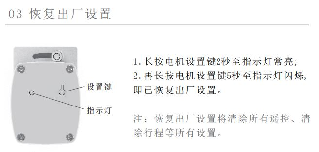
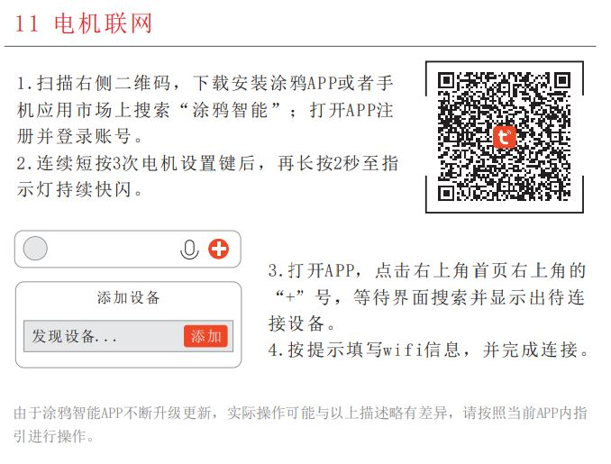

## 下載 SmartLife app 
- 首次使用E-mail註冊一個帳戶
- 手機開啟藍牙窗簾電機進入連網模式
- 打開app使用添加設備自動搜尋產品並指定wifi(2.4G wifi only)
- 接入app能正常控制電機完成初步設置。
- 進入app 點選 > 我 (右下位置) > 設置 (右上位置) > 帳號與安全 > 用戶 Code 紀錄備用 
  
## 接入HA (搭配電腦使用較方便)
- HA的整合插件頁面 > 新增整合 > 搜尋 tuya 輸入User Code (用戶 Code) 畫面出現二維條碼
- SmartLife app 右上點選掃描條碼的 icon 掃描完成即可接入HA

## 恢復出廠值

